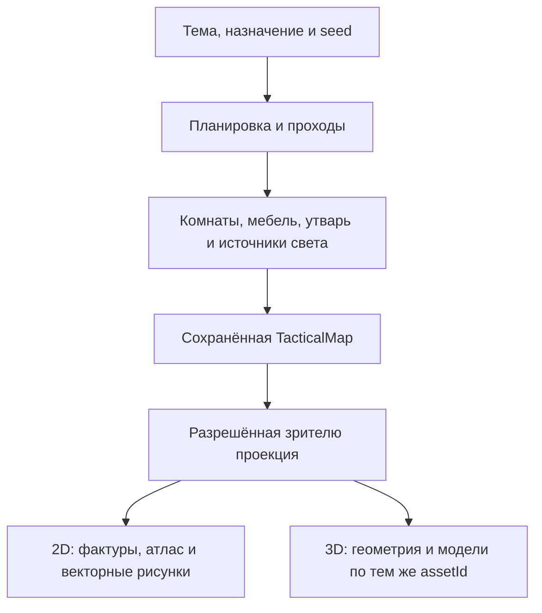

# Одна генерация локации, два вида карты

Генератор создаёт состояние локации, а её 2D- и 3D-виды показывают одно и то же
состояние. Переключение вида не запускает генерацию повторно и не меняет двери,
занимаемые клетки, укрытия, случайные варианты или расстановку.



## Существующие владельцы данных

- `server/scene-themes.mjs`, `buildThemedScene` — выбор темы и общей планировки.
- `server/building-generator.mjs`, `server/level-generator.mjs` — здания и этажи.
- `server/prop-placement.mjs`, `placeProps` — назначение комнаты, плотность,
  обязательные предметы, связанные группы (стол со стульями, очаг с дровами),
  свободные проходы, поворот и масштаб. Расстановка воспроизводится по seed.
- `server/asset-registry.mjs` — допустимые `assetId`, темы, якоря размещения,
  занимаемые клетки, проходимость, укрытия и интерактивность.
- `server/tactical-map.mjs` и хранилище карт — сохранённая структура локации.
- `server/viewer-projection.mjs` — разрешённая игроку информация.

Новый генератор специально для 3D не нужен. В нём возникла бы вторая версия
дверей и препятствий, способная разойтись с правилами и сохранениями.

## Согласованные представления ассетов

Два представления связывает `assetId`, например `chair`, `table_round` или
`sarcophagus`. Рендер 2D выбирает изображение из существующего атласа либо
векторный рисунок. Рендер 3D выбирает соответствующую модель предмета в
`src/board3d-props.ts`. Каталог покрывает все 105 зарегистрированных видов
предметов и декалей; общие геометрии и материалы переиспользуются внутри сцены.

`propVisualLayout` в `src/board-render.ts` даёт обоим видам один центр, локальные
размеры, масштаб и поворот. Футпринт уже повёрнут генератором: до рисования его
размер возвращается в локальные оси, а поворот применяется один раз. Поэтому
стойка, занимающая четыре клетки вдоль стены, остаётся на этих клетках в обоих
видах. Для мелкой утвари без футпринта используются существующие визуальные
габариты 2D, а не случайный размер 3D-заглушки.

Новая расстановка v3 сохраняет откалиброванный масштаб мебели и посуды из
`asset-registry.scaleRange`. Размеры стульев, табуретов и столов проверены
рядом с человеческими фигурками. Чтение старой карты не меняет её `scale`.
`mount: { kind: 'surface', propId }` ставит утварь на разрешённую опору;
`mount: { kind: 'wall', side }` задаёт крепление у стены. Позиции на столе
учитывают его масштаб. Скрытая опора скрывает украшение, сломанная опускает
его на пол; игровая площадь, укрытие и добыча от этого не меняются.

Фактура пола, поверхности и декали берутся из того же набора terrain, которым
пользуется 2D. Дверь строится по каноническому ребру и его состоянию. Форма и
направление области заклинания общие через `spellBurstCells` и `areaCells`.

Полноценная библиотека предполагает соответствующее оформление для каждого
вида предмета. При подготовке новых ассетов 2D-изображения можно получать
рендером 3D-моделей сверху; отдельно рисовать каждую пару необязательно.
Но картинка сама по себе не содержит положения петли, объёма, высоты и других
данных, достаточных для восстановления корректной 3D-модели.

## Готовые модели и парные 2D-виды

`public/assets/models/environment/manifest.json` связывает готовые GLB с
каноническими `assetIds`. В записи также есть название, категория, исходный
поворот и кадр общего `topdown.png`. Происхождение и лицензии хранятся рядом
с файлами. `src/prop-model-catalog.ts` выбирает вариант по стабильному `prop.id`;
оба рендера получают одну и ту же модель для одного предмета.

3D загружает только модели раскрытого реквизита, по четыре запроса одновременно.
Экземпляры одной модели внутри сцены используют общие геометрию и материалы,
поэтому повторяющиеся бочки и деревья объединяются прежним батчером.
Самодостаточный GLB проверяется до разбора; недоступный файл оставляет
процедурное представление. При уходе со сцены загрузка отменяется, ресурсы
освобождаются. Неиспользуемые модели из каталога не загружаются.
Байты уже проверенных GLB переиспользуются между сценами в кэше до 32 МиБ;
разобранными геометриями и текстурами владеет только текущая сцена.

Для 2D используется изображение той же модели строго сверху: камера, исходный
поворот и пропорции согласованы с 3D. На мелком масштабе остаётся дешёвый
силуэт. Записи без привязки к существующему `assetId` доступны как библиотека,
но генератор пока их не размещает. Добавление файла не создаёт нового игрового
предмета и не меняет его проходимость или взаимодействия.

Подготовка целого выпуска не требует Blender или новых зависимостей:

```bash
pnpm models:prepare --out tmp/environment-candidate-1
# Открыть выданный локальный адрес и нажать «Создать 2D-виды».
pnpm models:publish --dir tmp/environment-candidate-1 --dry-run
pnpm models:publish --dir tmp/environment-candidate-1
pnpm verify
```

Инструмент рисует игровые GLB через установленный Three.js и сохраняет
прозрачный PNG-атлас с координатами кадров в каталоге. Это подготовка ассетов;
WebGL не требуется игроку, использующему только 2D.

### Кандидат и опубликованный выпуск

`models:prepare` проверяет SHA-256 обоих исходных архивов по закреплённым
значениям, импортирует GLB, применяет палитру Kenney и запускает локальный
рендер атласа. Отсутствующий или другой архив останавливает подготовку до
записи файлов. В `build.sourceInputs` отдельно записаны хеши действительно
прочитанных исходных файлов; хеш архива не выдаётся за проверку произвольного
распакованного каталога. В метаданные не попадают абсолютные пути и время
сборки. Версии импортера, нормализации и выбора также фиксируются.

Путь кандидата задаётся явно и должен быть новым либо пустым; каталоги рабочих
ассетов, данных, зависимостей и Git запрещены. Исходники по умолчанию лежат в
`tmp/`, как в предыдущем импортере. Для другого расположения поддержаны
`--quaternius-dir`, `--kenney-dir`, `--quaternius-archive`, `--kenney-archive`.

После сохранения атласа проверяется весь кандидат: каталог, ссылки GLB,
встроенные ресурсы, ограничения размера, PNG, хеш и непустые кадры, файлы
происхождения. `receipt.json` фиксирует отпечаток принятого набора. Публикация
повторно проверяет содержимое; изменение после приёмки требует новой проверки.
Она выполняется командой `pnpm models:check --dir tmp/environment-candidate-1`
и обновляет квитанцию только у корректного кандидата.

Для повторного рендера уже подготовленного кандидата доступен
`node tools/render-prop-model-atlas.mjs --dir tmp/environment-candidate-1`.
После него нужно выполнить `models:check`. Самостоятельный импортер теперь
требует `--out`; `--palette-only` также работает только с явным кандидатом.
Обычная подготовка уже включает нормализацию палитры.

12 оригинальных моделей таверны и склепа добавляются к ещё не опубликованному
кандидату командой `node tools/build-interior-models.mjs --dir <кандидат>`.
После добавления нужно заново отрисовать атлас и выполнить `models:check`.
Столы и стойка имеют именованный узел `surface-top`, саркофаг — отдельную
петлю крышки. Подвижные крышки и их дочерние меши исключаются из batching.

`models:publish` создаёт полный неизменяемый каталог
`public/assets/models/environment/releases/<id>/`, готовит обновление
`data/asset-rights.json` через существующий `registerAssets` и последним
заменяет активный `manifest.json`. Модели и атлас в нём ссылаются на файлы
конкретного выпуска. Старые файлы сохраняются для вкладок со старым каталогом;
повторная публикация того же кандидата использует тот же ID. Чужое содержимое
под существующим ID не перезаписывается. `--dry-run` выполняет проверку без
активации. Это локальная подготовка файлов репозитория, без push или развёртывания.

Блокировка не допускает две одновременные публикации одним инструментом. Изменение
активного каталога или реестра во время подготовки приводит к отказу.
При обработанной ошибке переключения возвращается прежний реестр и удаляется
только созданный этой попыткой неактивный выпуск. Это не транзакция операционной
системы над всем репозиторием: после принудительного завершения процесса нужно
проверить остаток блокировки и целостность файлов перед следующим запуском.

Хеш выпуска учитывает каталог и все его файлы, включая сведения о преобразовании.
Счётчик целостности сохраняет фиксированную базу прежних ассетов, а добавления
в `releases/` считает по объявленному составу выпуска. Необъявленные файлы
по-прежнему нарушают проверку. Файлы старых выпусков автоматически не удаляются.

Побитовая воспроизводимость PNG зависит от GPU, драйвера и версии рендера;
для сравнения кадров нужен закреплённый стенд. Структура, выбор моделей и
преобразование данных проверяются отдельно.

## Версия оформления карты

Новая `TacticalMap` сохраняет `catalogRevision` из `release.id` активного
манифеста. Поле проходит сериализацию, MapStore и разрешённую проекцию.
Сохранения без поля читаются без изменения их данных и хеша: клиент использует
`baseline-pr79.json` с прежним порядком моделей и URL. Старые файлы этого
каталога, как и каталоги `releases/<id>/`, нельзя перезаписывать.

Оба вида загружают конкретную ревизию, а 2D-тайл включает её в ключ отдельно
от хеша PNG. Несколько карт с разными выпусками могут быть открыты одновременно.
Неизвестная ревизия и ошибка загрузки оставляют резервное представление;
последующий вход может повторить загрузку. Подмена на активный выпуск запрещена.
Старым вкладкам, открытым до появления этого контракта, требуется обновление
страницы. Смена оформления уже сохранённой карты отдельной командой пока
не предусмотрена; рабочие кампании автоматически не переписываются.

## Проверка системы

Проверки должны охватывать весь реестр и обычные генераторы разных тем:

1. Для каждого зарегистрированного вида реквизита существует соответствующее
   3D-представление; неизвестный вид не принимается за другой по части имени.
2. Для одинакового seed совпадают исходные props и их визуальная раскладка.
3. Центры, размеры и направления совпадают в 2D и 3D, включая поворот 90°.
4. Двери проверяются на восточном и южном ребре в разных состояниях.
5. Скрытые предметы, источники света и геометрия не выдаются рендером.
6. Текстуры и ресурсы освобождаются при уходе со сцены; ошибка ассета не
   меняет состояние игры и не ломает возможность вернуться в 2D.

Тестовая арена с двумя предметами не показывает полноту генератора. Для
визуальной проверки используются локации, собранные `buildThemedScene` с
разными темами и seed, с их настоящими комнатами и расстановкой реквизита.

`test/board3d-generation.test.mjs` прогоняет семь основных тем и крепость Ареса
на трёх seed, проверяет весь реестр, совпадение координат и освобождение
ресурсов. `test/board3d-scene.test.mjs` проверяет двери, UV, свет и палитры.

## Производительность представления

Декодированная карта сохраняется при `map_unchanged`. Окружение сравнивается
по содержимому, этажу, раскрытию и выпуску каталога. Геометрия наложений
перестраивается только при изменении формы или раскрытия пола. Смена локальной
фигурки отменяет загрузку прежней модели этого участника и сохраняет остальных.

Акторы и реквизит разделяют кэш проверенных байтов GLB до 32 МиБ. Одновременные
потребители одного файла используют общий запрос; отмена одного не прерывает
остальных, а отмена последнего останавливает запрос. Ошибки не закрепляются в
кэше. Разобранные модели и их геометрии принадлежат отдельной сцене: поздний
результат удалённого участника освобождается. Кэш каталогов и 2D-атласов хранит
до 12 завершённых выпусков; открытая 2D-доска удерживает свой атлас до ухода.

Диагностика `.board3d-canvas` включает количество и причины пересборок,
синхронное время подготовки, число запросов/разборов/попаданий в кэш, объём
байтов, очередь анимации и `renderer.info.memory`. `created`/`disposed`
считают логические экземпляры сцены и фигурок, а не байты видеопамяти.
В диагностике нет содержимого карты, инвентаря или скрытых участников.

`src/board3d-batching.ts` объединяет неподвижные непрозрачные меши с общей
геометрией и материалом в `InstancedMesh`, сохраняя мировые матрицы. Прозрачные,
анимированные и скрытые объекты в такие группы не попадают. Генератор и
события игры от способа отрисовки не зависят.

DOM-слой содержит только видимые подписи, участников и элементы взаимодействия.
Пустые клетки обрабатывает проекция указателя на карту. При перемещении камеры
размер окна читается один раз перед записью стилей; на неподвижной карте подписи
не пересчитываются ради каждого кадра анимации скелета.

Для проверки в атрибутах `.board3d-canvas` есть `data-fps`, `data-render-ms`,
`data-render-p95-ms`, `data-frame-p95-ms`, `data-draw-calls`, `data-triangles`,
счётчики пересборок, загрузок, разбора и ресурсов. FPS здесь — частота вызовов рендера в
данном браузере, а не гарантия частоты показа кадров монитором. Живые анимации
работают через `requestAnimationFrame` без принудительной паузы между кадрами;
выключенные анимации и скрытая вкладка не поддерживают постоянный цикл.
`render-ms` и его p95 измеряют CPU вместе с подготовкой кадра, не GPU.
Профили качества ограничивают DPR, размер солнечной тени, тени местных
источников и детализацию эффектов. «Экономное» также замораживает idle;
без активного действия и выключенного FPS оно ждёт изменения сцены.

## Границы текущей реализации

Согласованность данных и художественное качество — разные задачи. Проверка
покрытия не превращает условную геометрию в детализированные игровые ассеты.
Четыре персонажа KayKit стилизованы; путник и следопыт Quaternius добавляют
человеческие пропорции, но не закрывают все расы, классы и лица.

Пол строится по высоте раскрытых клеток; вертикальные грани закрывают уступы
и внешний край карты. Высоты в сохранении заданы в футах и переводятся в
мировые единицы клетки. Подняты и фигурки, предметы, дверные основания,
подсветка и эффекты; выбор указателем проверяется по поверхности рельефа.
Надписи высот на 3D-полу не печатаются, а в 2D остаются.
Полноценные крыши, своды, плавные склоны и несколько перекрывающихся этажей
требуют отдельной реализации. Видимое оружие поддержано условными комплектами;
оно не воспроизводит каждую вещь и каждый клип из каталога правил.
Состояние существующих кампаний ради этих изменений не пересоздаётся.
