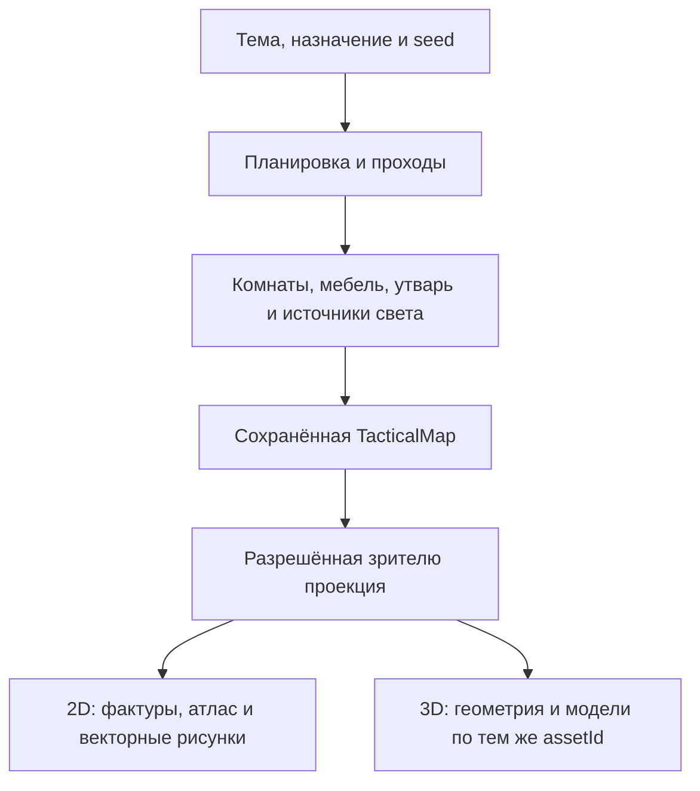

# Одна генерация локации, два вида карты

Генератор создаёт состояние локации, а её 2D- и 3D-виды показывают одно и то же
состояние. Переключение вида не запускает генерацию повторно и не меняет двери,
занимаемые клетки, укрытия, случайные варианты или расстановку.



## Существующие владельцы данных

- `server/scene-themes.mjs`, `buildThemedScene` — выбор темы и общей планировки.
- `server/building-generator.mjs`, `server/level-generator.mjs` — здания и этажи.
- `server/prop-placement.mjs`, `placeProps` — назначение комнаты, плотность,
  обязательные предметы, связанные группы (стол со стульями, очаг с дровами),
  свободные проходы, поворот и масштаб. Расстановка воспроизводится по seed.
- `server/asset-registry.mjs` — допустимые `assetId`, темы, якоря размещения,
  занимаемые клетки, проходимость, укрытия и интерактивность.
- `server/tactical-map.mjs` и хранилище карт — сохранённая структура локации.
- `server/viewer-projection.mjs` — разрешённая игроку информация.

Новый генератор специально для 3D не нужен. В нём возникла бы вторая версия
дверей и препятствий, способная разойтись с правилами и сохранениями.

## Согласованные представления ассетов

Два представления связывает `assetId`, например `chair`, `table_round` или
`sarcophagus`. Рендер 2D выбирает изображение из существующего атласа либо
векторный рисунок. Рендер 3D выбирает соответствующую модель предмета в
`src/board3d-props.ts`. Каталог покрывает все 105 зарегистрированных видов
предметов и декалей; общие геометрии и материалы переиспользуются внутри сцены.

`propVisualLayout` в `src/board-render.ts` даёт обоим видам один центр, локальные
размеры, масштаб и поворот. Футпринт уже повёрнут генератором: до рисования его
размер возвращается в локальные оси, а поворот применяется один раз. Поэтому
стойка, занимающая четыре клетки вдоль стены, остаётся на этих клетках в обоих
видах. Для мелкой утвари без футпринта используются существующие визуальные
габариты 2D, а не случайный размер 3D-заглушки.

Фактура пола, поверхности и декали берутся из того же набора terrain, которым
пользуется 2D. Дверь строится по каноническому ребру и его состоянию. Форма и
направление области заклинания общие через `spellBurstCells` и `areaCells`.

Полноценная библиотека предполагает соответствующее оформление для каждого
вида предмета. При подготовке новых ассетов 2D-изображения можно получать
рендером 3D-моделей сверху; отдельно рисовать каждую пару необязательно.
Но картинка сама по себе не содержит положения петли, объёма, высоты и других
данных, достаточных для восстановления корректной 3D-модели.

## Готовые модели и парные 2D-виды

`public/assets/models/environment/manifest.json` связывает готовые GLB с
каноническими `assetIds`. В записи также есть название, категория, исходный
поворот и кадр общего `topdown.png`. Происхождение и лицензии хранятся рядом
с файлами. `src/prop-model-catalog.ts` выбирает вариант по стабильному `prop.id`;
оба рендера получают одну и ту же модель для одного предмета.

3D загружает только модели раскрытого реквизита, по четыре запроса одновременно.
Экземпляры одной модели внутри сцены используют общие геометрию и материалы,
поэтому повторяющиеся бочки и деревья объединяются прежним батчером.
Самодостаточный GLB проверяется до разбора; недоступный файл оставляет
процедурное представление. При уходе со сцены загрузка отменяется, ресурсы
освобождаются. Неиспользуемые модели из каталога не загружаются.
Байты уже проверенных GLB переиспользуются между сценами в кэше до 32 МиБ;
разобранными геометриями и текстурами владеет только текущая сцена.

Для 2D используется изображение той же модели строго сверху: камера, исходный
поворот и пропорции согласованы с 3D. На мелком масштабе остаётся дешёвый
силуэт. Записи без привязки к существующему `assetId` доступны как библиотека,
но генератор пока их не размещает. Добавление файла не создаёт нового игрового
предмета и не меняет его проходимость или взаимодействия.

Пересборка 2D-видов не требует Blender или новых зависимостей:

```bash
node tools/render-prop-model-atlas.mjs
# Открыть выданный локальный адрес и нажать «Создать 2D-виды».
node tools/register-asset-rights.mjs --all-under models
```

Инструмент рисует игровые GLB через установленный Three.js и сохраняет
прозрачный PNG-атлас с координатами кадров в каталоге. Это подготовка ассетов;
WebGL не требуется игроку, использующему только 2D.

## Проверка системы

Проверки должны охватывать весь реестр и обычные генераторы разных тем:

1. Для каждого зарегистрированного вида реквизита существует соответствующее
   3D-представление; неизвестный вид не принимается за другой по части имени.
2. Для одинакового seed совпадают исходные props и их визуальная раскладка.
3. Центры, размеры и направления совпадают в 2D и 3D, включая поворот 90°.
4. Двери проверяются на восточном и южном ребре в разных состояниях.
5. Скрытые предметы, источники света и геометрия не выдаются рендером.
6. Текстуры и ресурсы освобождаются при уходе со сцены; ошибка ассета не
   меняет состояние игры и не ломает возможность вернуться в 2D.

Тестовая арена с двумя предметами не показывает полноту генератора. Для
визуальной проверки используются локации, собранные `buildThemedScene` с
разными темами и seed, с их настоящими комнатами и расстановкой реквизита.

`test/board3d-generation.test.mjs` прогоняет семь основных тем и крепость Ареса
на трёх seed, проверяет весь реестр, совпадение координат и освобождение
ресурсов. `test/board3d-scene.test.mjs` проверяет двери, UV, свет и палитры.

## Производительность представления

`src/board3d-batching.ts` объединяет неподвижные непрозрачные меши с общей
геометрией и материалом в `InstancedMesh`, сохраняя мировые матрицы. Прозрачные,
анимированные и скрытые объекты в такие группы не попадают. Генератор и
события игры от способа отрисовки не зависят.

DOM-слой содержит только видимые подписи, участников и элементы взаимодействия.
Пустые клетки обрабатывает проекция указателя на карту. При перемещении камеры
размер окна читается один раз перед записью стилей; на неподвижной карте подписи
не пересчитываются ради каждого кадра анимации скелета.

Для проверки в атрибутах `.board3d-canvas` есть `data-fps`, `data-render-ms`,
`data-draw-calls` и `data-triangles`. FPS здесь — частота вызовов рендера в
данном браузере, а не гарантия частоты показа кадров монитором. Живые анимации
работают через `requestAnimationFrame` без принудительной паузы между кадрами;
выключенные анимации и скрытая вкладка не поддерживают постоянный цикл.

## Границы текущей реализации

Согласованность данных и художественное качество — разные задачи. Проверка
покрытия не превращает условную геометрию в детализированные игровые ассеты.
Четыре подключённых персонажа KayKit стилизованы; для более реалистичного
облика нужна согласованная библиотека другого художественного направления.

Пол строится по высоте раскрытых клеток; вертикальные грани закрывают уступы
и внешний край карты. Высоты в сохранении заданы в футах и переводятся в
мировые единицы клетки. Подняты и фигурки, предметы, дверные основания,
подсветка и эффекты; выбор указателем проверяется по поверхности рельефа.
Надписи высот на 3D-полу не печатаются, а в 2D остаются.
Полноценные крыши, своды, плавные склоны, несколько перекрывающихся этажей
и видимая экипировка персонажей требуют отдельного оформления.
Состояние существующих кампаний ради этих изменений не пересоздаётся.
