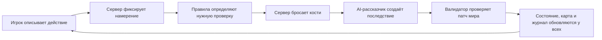

# MVP: границы и развитие

## Проверяемая гипотеза

Группе интересно провести 30–60 минут в одной сессии, если рассказчик:

1. помнит важные факты сцены;
2. принимает свободно сформулированные действия;
3. объясняет последствия честно и достаточно быстро;
4. поддерживает единое для всех состояние карты и истории.

В первой пользовательской проверке важнее качество этого цикла, чем полный свод правил или генератор персонажей.

## Игровой цикл



Критично: модель не должна сама сообщать итог броска и бесконтрольно менять состояние. Кости бросает сервер, а предложенные AI изменения проходят валидацию.

## Формат ответа AI

Вместо одного текстового ответа сервер ожидает объект примерно такой формы:

```json
{
  "narration": "Руна вспыхивает, открывая скрытый проход…",
  "check": { "skill": "arcana", "difficulty": 13 },
  "mapPatch": {
    "reveal": [{ "x": 7, "y": 2 }],
    "move": [],
    "spawn": []
  },
  "memory": ["Группа обнаружила восточное хранилище"],
  "suggestions": ["Войти в проход", "Осмотреть руну"]
}
```

На практике проверку лучше запросить у модели до броска, затем вторым коротким запросом получить последствие с уже известным результатом. Так результат честен, а текст соответствует броску.

## Следующая техническая итерация

| Область | Для production-MVP |
|---|---|
| Клиент | React/Next.js, текущие экран комнаты и карта |
| Сервер | Node.js, авторитетное состояние сессии |
| Real-time | WebSocket-комната с восстановлением после разрыва |
| Данные | PostgreSQL: кампании, сцены, персонажи, сообщения, события |
| AI | RouterAI-адаптер с tool calling, таймаутом и локальным fallback — реализовано |
| Карта | генератор шаблонов/тайлов + валидируемые патчи |
| Изображения | фоновая иллюстрация сцены; не источник координат |
| Файлы | объектное хранилище для портретов и иллюстраций |

Состояние удобнее хранить как журнал событий (`player_action`, `dice_rolled`, `scene_updated`, `message_added`). Из него можно восстановить текущую сцену, сделать повтор хода и расследовать ошибки рассказчика.

Текущая реализация использует OpenAI-совместимый RouterAI API по тому же принципу, что и CKI test. Модель ведёт повествование и выбирает инструменты, но сами функции исполняет сервер. Файл `.env` не входит в git.

Портреты героев хранятся в `public/assets/party-portraits.png` как единый atlas. У каждого персонажа есть URL ассета и позиция внутри atlas. Следующий шаг для существ — отдельный реестр `entityKind → asset/model`, чтобы `spawn_entity` автоматически выбирал визуальную модель.

Инвентарь хранится внутри персонажа. Предмет содержит тип, количество, вес, редкость, описание, механические свойства, изображение, промпт изображения и статус генерации. `grant_item` разрешён только серверному агенту; описание и промпт создаёт модель, но владелец может отредактировать результат.

Импорт листов основан на JSON-подходе Long Story Short. Поскольку формат развивался, импортёр не зависит от одной версии схемы: он рекурсивно ищет известные названия полей, переносит характеристики и преобразует найденное снаряжение в редактируемые карточки.

## Что стоит добавить до игры с друзьями

- создание комнаты, имя игрока и вход по ссылке;
- ведущий комнаты: пауза, отмена последнего хода, ручная правка сцены;
- приватные сообщения и индивидуальный туман войны;
- лист персонажа, инвентарь, состояния, заклинания и отдых;
- режим очереди: по одному игроку или сбор намерений всей группы;
- сохранения кампании, переподключение и история версий;
- границы тона и тем кампании, стоп-сигнал и возможность переписать неудачную сцену;
- ограничение длины контекста: краткая память кампании отдельно от полного журнала;
- контроль стоимости и задержки генерации, запасной ответ при недоступности AI;
- использование только правил, текстов и иллюстраций с подходящими правами.

## Как тестировать гипотезу

Провести три коротких партии по одной и той же сцене и измерить:

- время от отправки действия до ответа;
- число случаев, когда рассказчик противоречит карте или прошлым фактам;
- сколько раз игроки используют свободный ввод вместо подсказок;
- сколько ручных исправлений требуется за 30 минут;
- хотят ли игроки продолжить эту же кампанию.

Только после этого имеет смысл расширять свод правил и строить большой редактор кампаний.
