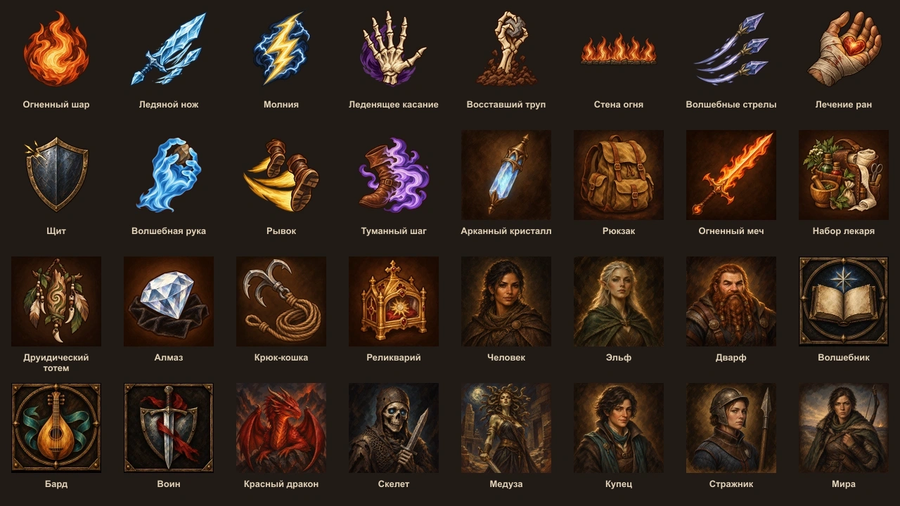

# Переработка графики — октябрь 2026

Работа выполняется по запросу владельца на основе плана PR #129. Запрос шире
исходного плана: заклинания, все предметы, расы и классы также перерисовываются.
Приоритет: заклинания, предметы, расы, классы, остальные изображения интерфейса.

Владелец выбрал вариант «Огненного шара» с крупными мазками и матовой фактурой.
Он задаёт живописную манеру набора; `action-atlas-v1.webp` остаётся вторичным
ориентиром для материалов и мира. Цвет следует предмету или эффекту. Силуэт,
фактура кисти и тёмный контур важнее мелких деталей. Бронзовая рамка и фон
действия существуют отдельно от прозрачного рисунка.

## Состав набора

Всего 1172 файла: 951 замена существующей графики и 221 новый рисунок.

| Группа | Файлов | Записи происхождения |
| --- | ---: | --- |
| Заклинания | 439 | `pilot.json`, `spells-*.json` |
| Действия классов, подклассов и общие действия | 250 | `actions-01.json`—`actions-07.json` |
| Управление и состояния | 26 + 23 | `hud.json`, `conditions.json` |
| Фоны действий и фактура значков | 6 + 1 | `backgrounds.json`, `scenes-07.json` |
| Предметы: каталог, стартовые вещи, запасные изображения типов | 188 | `pilot.json`, `items-01.json`—`items-06.json` |
| Расы и классы | 10 + 12 | `pilot.json`, `species.json`, `classes.json` |
| NPC и противники | 16 + 105 | `npcs-01.json`, `enemies-01.json`—`enemies-04.json` |
| Иллюстрации сцен и карты | 18 + 73 | `scenes-01.json`—`scenes-07.json` |
| Сундук и лестница руин | 2 | `scenes-08.json` |
| Два сборных атласа и карта архива Норвина | 3 | `provenance-replacements.json` |

Новые файлы: 157 недостающих действий, 26 значков управления, 23 состояния и
15 стартовых предметов. Остальные сохраняют прежние пути. Все 20 описаний
стартовых вещей, заимствовавших картинки заклинаний, получили предметные
изображения; часть использует уже существующие каталожные рисунки.

Точные промпты, идентификаторы исходников, инструмент и дата находятся в
перечисленных JSON-файлах. Рисунки созданы встроенным OpenAI ImageGen;
полноразмерные исходники сохранены отдельно от Git. При стилизации портретов
и карт старые изображения служили референсом идентичности и композиции.
Это не отменяет проверки прав: общие поля `rights_status` и `distribution`
не меняются. Происхождение сборных атласов и карты архива описано отдельно.

## Подключение к интерфейсу

Действия и заклинания выбираются по каталожным ID. Все состояния с рисунком
используют общий `ConditionMark`, неизвестные сохраняют текстовый знак.
В существующие кнопки подключены 18 значков управления; ещё восемь подготовлены
для соответствующих действий (`leave-scene`, `unarmed-strike`, `throw`,
`look-around`, `turn-based`, `sneak`, `hasted-action`, `sculpt-spells`), но
отдельных кнопок ради рисунков не добавлено. Там, где интерфейс показывает
выбранный предмет, его рисунок имеет приоритет.

Сохранённые стартовые вещи переназначаются только при точном совпадении названия
и известной старой картинки. Остальные пользовательские изображения остаются
своими. Механика, стоимость действий и статусы поддержки заклинаний не изменены.

## Форматы и проверка

- Заклинания, действия и служебные значки: PNG RGBA 256×256; прозрачные углы,
  длинная сторона видимого силуэта 82–88% холста, до 120 КБ.
- Состояния: PNG RGBA 256×256, силуэт 70–78%; проверка при 16–20 пикселях.
- Предметы: PNG 512×512 на тёмном коричневом фоне; весь предмет внутри кадра.
- Портреты рас: PNG 256×256; роли NPC: PNG 320×320; остальные портреты: PNG
  512×512. Лицо читается в круглом кадре 64 пикселя.
- Классы: WebP 256×256. Иллюстрации сцен и карт сохраняют прежние размеры,
  пропорции и смысловую географию.

Каждый установленный файл получает актуальный SHA-256 и размер в
`data/asset-rights.json`. Визуальная проверка учитывает анатомию, отсутствие
псевдотекста, различимость близких эффектов и размер игровых кнопок.
После полной интеграции выполнены:

- `pnpm verify`: 5689 успешных проверок, шесть штатных пропусков проверок
  исходных 3D-архивов; проверка типов сервера и сборка клиента прошли.
- `pnpm content:verify`: все 3476 файлов зарегистрированы, размеры и SHA-256
  совпадают. Общие ограничения прав сохранены.
- Пофайловая сверка набора: 1172 из 1172, включая все 951 замены и 221 новый
  файл; пропусков и расхождений происхождения нет.
- Независимый просмотр всех партий и проверка кода. Исправлены размеры
  значков состояния и устаревшие ожидания картинок стартовых вещей в тестах.

Основной сценарий интерфейса с двумя игроками пока не проверен: браузерный инструмент
отклонил локальный предпросмотр по политике URL. Просмотр исходников и контактных
листов не считается заменой этой проверки.

Шрифты, звук, рабочие данные кампаний, тестовые копии, документы со старыми
скриншотами, 3D-модели и их материалы, технические атласы предметов и местности
не входят в набор самостоятельных иллюстраций. Исходные листы и старые
неиспользуемые HD-тайлы замка также сохранены. `action-atlas-v1.webp` остаётся
выбранным владельцем стилевым ориентиром и запасным рисунком интерфейса.
