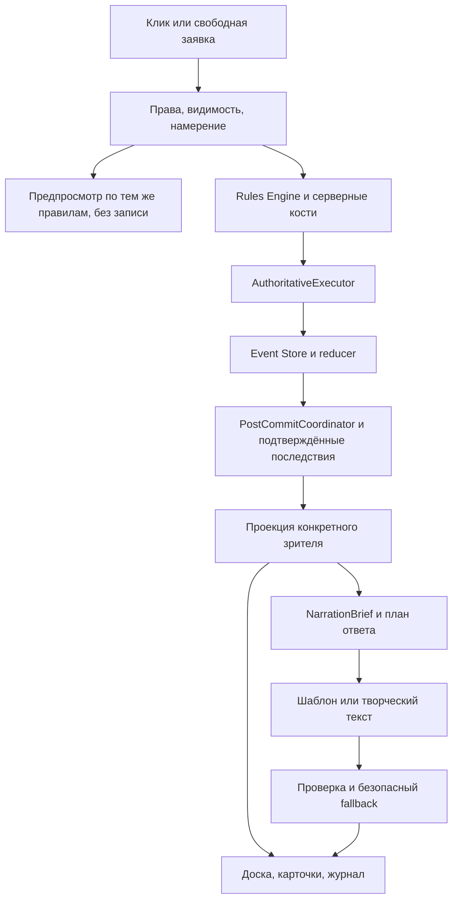

# «Сказание»: опыт BG3 и план следующего этапа

Дата исследования: **4 октября 2026**. Срез кода: `cb045a8466f35696ff24abe9020d6f39dee89462`
из `Anyukhin/skazanie-dnd`, включая обновлённый боевой HUD.
**Статус: исследование и предлагаемый план, не реализованные возможности.**
Этот PR меняет документацию; предложенные механики требуют отдельных PR.

## 1. Что даст наибольший результат

У «Сказания» уже есть основа системной ролевой игры: авторитетный движок,
события и replay, реакции, взаимодействие с окружением, многоуровневые карты,
память NPC, свободные заявки и несколько способов рассказать подтверждённый
результат. Следующая задача — соединить эти возможности в понятный вечер игры.

Рекомендуемый порядок:

1. **Игрок понимает, что произойдёт.** Цена действия, допустимая цель, причина
   отказа, известный риск и результат видны в одном месте до подтверждения.
2. **Слова, карта и события описывают один мир.** Обещанный предмет существует,
   успешный прыжок действительно перемещает, маршрут ведёт в нужное место.
3. **Сцена предлагает разные решения.** Обход, разговор, скрытность и бой
   различаются последствиями; провал меняет ситуацию и оставляет продолжение.
4. **Рассказчик держит темп и причинность.** Рутинный результат краток,
   важный момент выразителен, NPC помнят только доступные им факты.
5. **Карта помогает выбирать.** Она показывает полезные позиции, входы,
   объекты и этажи, оставаясь читаемой и устойчивой при повторном посещении.

Это соответствует [продуктовым принципам](product-principles.md). BG3 служит
примером выразительности решений, а не источником правил для незаметной замены
выбранной редакции D&D. Новые классы, полный набор спутников и дорогой 3D сами
по себе не исправят непонятное действие или противоречие рассказа карте.

## 2. Основания и границы анализа

Доказательства первого прохода и внешние источники вынесены в пять приложений.
Продолжение с более узкими экспериментами — в разделе 11.

| Приложение | Содержание |
| --- | --- |
| [BG3: первичные источники](research/bg3-design-reference-2026-10-04.md) | Механики, интерфейс и ограничения переноса |
| [Другие проекты и подходы](research/rpg-reference-patterns-2026-10-04.md) | VTT, тактические RPG, авторские диалоги и память ИИ |
| [Аудит механик](research/mechanics-audit-2026-10-04.md) | Реальные handlers, события, тесты и незавершённые срезы |
| [Карта и UX](research/map-ux-audit-2026-10-04.md) | Состояние доски, HUD, генератора и пользовательских путей |
| [Рассказчик и архитектура](research/narrator-architecture-audit-2026-10-04.md) | Контракты, варианты эволюции, места изменений |

Внутренние утверждения сверялись с кодом и профильными тестами, а не только
со старыми планами. Наблюдения браузерных сессий взяты из существующих отчётов
и [известных ограничений](known-limitations.md), включая записи 2–4 октября;
новая живая партия и замер реального LLM в этом исследовании не проводились.
Внешние источники подтверждают описанное авторами поведение, но не раскрывают
внутреннюю архитектуру закрытых игр. Оценки полезности и трудоёмкости ниже —
инженерные рекомендации для «Сказания».

**Не начинать заново уже сделанное.**

| Область | Уже есть | Следующая полезная разница |
| --- | --- | --- |
| Боевой интерфейс | Новый HUD, колоды действий, прицеливание, движение, инициатива | Единая понятная причина доступности и меньше перекрытий карты |
| Реакции | Серверные окна и режимы «спросить / сразу / никогда» | Объяснение триггера, цены и автоматического решения |
| Окружение | Двери, предметы, опасности, укрытия, высота | Связать свободную заявку, предпросмотр и фактическое изменение мира |
| Карта | 2D/3D, этажи, библиотека TaleSpire, программа сцены, проверки качества | Несколько осмысленных маршрутов и паритет интеракций между режимами |
| Повествование | `narrator/v12`, план ответа, проверка фактов, запасной текст | Проверяемая уместность, качество fallback и причинность сложных заявок |
| Память | Факты, отношения, последствия, рекапы, личные знания | Видимый игроку след решения без утечки секретов |
| Архитектура | `AuthoritativeExecutor`, `PostCommitCoordinator`, Event Store | Уточнять существующие интерфейсы и переносить связные участки по одному |
| Мобильный экран | Вкладки сцены/хроники уже присутствуют | Проверять существующие пути; полная мобильная переработка отложена |

Названия существующих полей и команд в приложениях — факт кода. Новые
контракты в этом плане — предложения; их точные имена определяются в спецификации.

## 3. Что переносить из BG3

Подтверждения особенностей BG3 и ссылки на материалы Larian собраны в
[исследовании](research/bg3-design-reference-2026-10-04.md). Здесь — перевод
этих принципов на задачи нашего проекта.

| Принцип опыта BG3 | Адаптация для «Сказания» | Ограничение |
| --- | --- | --- |
| Осмысленный выбор действия и ресурса | Предпросмотр цены и причин отказа рядом с целью | Не показывать скрытые КД, спасброски и сопротивления через вычисленный процент |
| Контекстное изучение мира | Карточка объекта: что известно, что можно сделать, почему нельзя | Только разрешённая конкретному игроку проекция |
| Окружение участвует в решении | Несколько подготовленных сочетаний предметов, опасностей и маршрутов | Без всеобщей физики и без выдуманной моделью механики |
| Разговор зависит от героя и истории | Доступные подходы по знаниям, чертам и отношениям | Варианты не заменяют свободный текст и не принимают решение за героя |
| Провал остаётся частью приключения | Новая цена, осложнение или другой доступный путь | Провал не превращается в скрытый успех, а смерть не отменяется текстом |
| Важный выбор получает отклик | Журнал «решение → подтверждённое последствие», возвращение NPC | Не раскрывать невидимые последствия раньше времени |
| Отдых задаёт ритм истории | Короткая сцена передышки по незавершённым обещаниям и фактам | Не делать обязательный лагерь и не добавлять NPC-спутника вопреки прежнему решению |
| Общая игра остаётся общей | Ясно видно, кто говорит, кто выбирает, кому адресован вопрос | Сохранить серверные права и политику группового решения |

Не переносить автоматически homebrew BG3: цены прыжка/толчка/предметов,
бонусы высоты, особенности зелий, отдыха и взаимодействий поверхностей.
Каждое расхождение проходит проверку выбранного `ruleset_id`; отдельный
режим правил стола возможен только как явное версионированное решение.

## 4. План работ по законченным результатам

Приоритеты: **P0** — мешает понять или закончить основной путь;
**P1** — заметно углубляет уже работающий цикл; **P2** — расширение после
приёмки основы. Это предлагаемая очередь, а не утверждение о severity всех
находок. Неповторённые наблюдения сначала воспроизводятся.

Оценки **S: 1–2, M: 3–5, L: 6–10 рабочих дней** — предварительные диапазоны
для одного исполнителя, включая профильные тесты и локальную приёмку, без
ожидания ревью. Уверенность средняя для UI, низкая для новых доменных контрактов;
L сначала режется на несколько PR. Это не обещание календарного срока.

### Волна 0. Зафиксировать реальный исходный уровень

**B01 · P0 · S — сценарий обычного вечера.** Два игрока создают героев,
принимают приглашение, находят улику, говорят с NPC, открывают дверь, проводят
бой, делят добычу, отдыхают, уходят и возвращаются. Повторить в 2014 и 2024
на новых временных кампаниях. Записать число тупиков, отказов, лишних кликов,
время первого понятного ответа. Добавить короткий smoke с пятью участниками.
Использовать существующие HTTP-тесты и ручной браузерный путь; новый тестовый
фреймворк не нужен. Выход: воспроизводимые шаги и снимки версий вместо списка
предположений. Владелец: приёмка; зависимости: нет.

**B02 · P0 · S — отделить живые ограничения от истории.** Проверить открытые
OB-01/OB-02, PC-03, QP-03, MG-04 из `known-limitations.md`; последние три
пока не считать доказанными дефектами. Сверить актуальные narrator/v12 и
map_architect/v8 с историческими упоминаниями. Закрытые старые бэклоги не
переиспользовать. Выход: каждая новая задача имеет путь воспроизведения или
помечена продуктовой гипотезой. Зависит от B01.

### Волна 1. Понятные действия и управление

**U01 · P0 · M — одна карточка намерения.** Расширить существующую выдачу
боевых действий и предпросмотр: цель, действие/бонус/реакция, движение,
ячейка/заряд, концентрация, известная опасность, конкретный отказ. Отдавать
публичные причины с сервера; браузер только оформляет. Если нужен отдельный
read-only preview, он вызывает ту же чистую проверку, что исполнение, без
броска, расхода, записи и LLM. Версия состояния связывает показанное с запросом;
устаревший preview пересчитывается, сама команда всё равно валидируется заново.
В качестве основы уже есть `combatForecast` и подтверждаемый `action_proposal`:
у последнего проверяются владелец, версия состояния и отпечаток плана
([реализация](../server/game-orchestrator.mjs#L2473)).
Первый узкий срез U01 — устранить подтверждённое несоответствие политики
скрытой КД и публичного процента попадания: см. раздел 11.4 и
[воспроизведение](research/combat-forecast-disclosure-2026-10-04.md).
Завершено, когда меню, хотбар и свободный ввод дают совместимые причины,
а два игрока видят только свои разрешённые сведения. Зависимость: B01.

**U02 · P0 · S/M — не терять создание героя.** Сохранять текущий черновик
в локальном хранилище с версией схемы и привязкой к пользователю/кампании;
восстановление явно предложить, устаревшие варианты провалидировать сервером.
До покупки показывать доступный остаток и перерасход. Для OB-02 сначала проверить
путь открытия: в `Spellbook` разделение героя и каталога уже есть; исправлять
конкретный непонятный экран или вход в него, а не создавать второй фильтр.
Завершено, когда закрытие окна и reload
не заставляют вводить всё снова, а старый черновик не выдаёт лишние ресурсы.
Основание: открытые OB-01/OB-02. Зависимость: B02.

**U03 · P1 · M — изучение цели без перегрузки.** Использовать текущие
карточки/tooltip для героя, врага, объекта, эффекта: краткое описание сверху,
подробности по закреплению/раскрытию, кнопка связанного действия. Одинаковый
порядок информации в 2D и 3D; фокус клавиатурой, Escape, сенсорное нажатие,
состояния не только цветом. Не раскрывать неизвестные числа противника.
Выход: новичок объясняет доступное действие по карточке без внешнего справочника.
Зависимость: U01 для новых причин, существующие карточки можно улучшать раньше.

**U04 · P1 · S/M — объяснимые реакции.** Поверх `ReactionModes` и
`reaction-preferences.mjs` показывать событие-триггер, расход и ожидаемое
защитное действие; после автореакции — короткий след в логе. Настройка остаётся
у владельца героя и переживает reconnect. Не добавлять вторую очередь реакций.
Выход: «спросить», «сразу», «никогда», одновременный ответ и повтор запроса
проходят существующие правила без двойного расхода. Зависимость: U01.

**U05 · P0 · M — камера и доступ к полю.** Сначала воспроизвести сообщения
о центрировании и верхних клетках под инициативой; затем выровнять координаты
клика, прокрутки и масштабирования, проверить низкие окна и разный DPR.
Возврат к герою и к текущему действию предсказуем; ручной просмотр карты не
сбрасывается каждым событием. Таймер хода виден заранее, его значение этим
пунктом не меняется. Выход: все видимые клетки достижимы указателем, выбор
цели сохраняется при смене масштаба; 2D работает при отказе WebGL. Зависимость: B01.

**U06 · P1 · M — стол знает, чего ждёт.** На одном месте показать активный
ход, ожидающую реакцию, голосование, ответ NPC и ожидание повествования;
различать уже применённое действие и ещё готовящийся текст. Использовать
существующие SSE и состояния восстановления. Список добычи фильтруется и
показывает доступного получателя, не вводя общего кошелька. Выход: после
переподключения оба игрока одинаково понимают следующего участника; неизвестный
исход запроса не провоцирует новое действие с другим ключом. Зависимость: U01.

### Волна 2. Рассказ и мир совпадают

**N01 · P0 · M — различить цель и способ свободного действия.** В существующем
арбитре и маршрутизаторе отдельно учитывать «что хочу узнать/изменить» и
«как пытаюсь». Пример: «проталкиваюсь к шлюзам и смотрю, кто их открывает»
не должен исчерпываться успешной Акробатикой без ответа об осмотре. При
неопределённости уточнять ровно недостающее. Никаких новых чисел от LLM.
Выход: корпус таких фраз даёт корректное действие, ограниченный план или
понятное уточнение; намерение не описывается как выполненное. Зависимость: B02.

**N02 · P0 · L — расширить исполнимую составную заявку.** Боевые
`approach_attack`, `long_jump_attack` и `swing_attack` уже имеют подтверждаемый
план; прыжок с ударом и люстра проверены вместе с отказом, расходом и replay
([сторож](../test/compound-maneuver-preview.test.mjs#L37)). Расширять этот путь
на отсутствующие ситуации, сохраняя фактический `MoveActor`/взаимодействие и
проверку геометрии. Для «прыгаю
с моста в реку» сервер выбирает допустимую точку, проверяет путь и правила,
фиксирует результат и последствия. Сначала один пилот, затем другие виды.
Частичный успех имеет явную политику: что произошло, где герой остановился,
что потрачено; повтор запроса не повторяет отдельный шаг. Выход: координаты,
хиты, текст и replay согласованы на успехе, провале и прерванном движении.
Не подменять это анимацией. Зависимости: N01, U01.

**N03 · P0 · L — предметы и обещания сцены материализуются до рассказа.**
Расширять существующие `scene-requirements` и программу сцены. Важный для
игрока свёрток из пролога должен иметь идентичность, место, видимость и
разрешённые взаимодействия; обычная декоративная деталь этого не требует.
Архитектор предлагает, сервер размещает и проверяет, затем фиксирует сцену.
Невоплощённый объект убирается из разрешённых фактов рассказчика. Выход:
свёрток можно найти, открыть или взять через существующие команды, повторное
посещение не создаёт копию, отсутствие места даёт безопасный fallback.
Зависимость: аудит каталога существующих интеракций. N03 сначала завершает
один предмет на существующей планировке; затем M02 расширяет размещение и
программу сцены. Порядок строго `N03 → M02`, обратной зависимости нет.

**N04 · P1 · M — настройка темпа, а не второй ведущий.** Расширить текущий
`narratorResponsePlan`: краткий исход, сценический ответ, реплика NPC,
важный момент. Уже имеющиеся стили не дублировать. Предпочтение подробности
меняет объём художественного текста, но не скрывает важный результат и
не меняет правила. Fallback строится из тех же фактов; повторяющиеся
«Вышло/Не вышло» заменяются несколькими грамматически безопасными формами.
Выход: краткий бросок не превращается в абзац погоды, диалог заканчивается
вовремя и не приписывает игроку следующий поступок. Зависимость: N06.

**N05 · P1 · M — последствия и знания с происхождением.** В существующей
памяти сохранять/использовать ссылку на подтверждающее событие, субъекта
знания и видимость; журнал показывает «что решили, что стало известно,
какая нить осталась». Личное знание не становится общим автоматически.
Явное действие «рассказать отряду» требует отдельного доменного контракта,
если его нет; сначала достаточно корректного личного журнала. Возвращённый
NPC вспоминает известное ему обещание, а не весь event log. Выход: две роли
видят разные разрешённые факты, recap не раскрывает тайну. Зависимость: B01.

**N06 · P0/P1 · M — оценка рассказчика на нынешнем контракте.** Переиспользовать
`eval/routerai-narrator-benchmark.mjs`, `eval/narrator-craft-eval.mjs` и
сохранённые случаи; закрепить хеши промптов, версию кода, входы и rubric.
Отдельно считать исходный ответ модели, отклонение guard и показанный fallback.
Сравнивать одну правку за раз на одинаковых сценах, затем вслепую оценивать
русский текст. Исторический [замер 1 октября](model-reasoning-sweep-2026-10-01.md)
опирается, в частности, на narrator/v9 и не доказывает качество v12.
Не назначать постоянного победителя по названию модели. Выход: отчёт качества,
задержки, цены и доли fallback с повторяемой выборкой. Сетевые замеры —
отдельный ограниченный запуск, не часть обычных offline-тестов.

### Волна 3. Карта как пространство решений

**M01 · P1 · M — тактическая читаемость.** Поверх текущей карты выделять
выбранную цель, доступное движение, известные опасности, укрытие, перепады
высоты, двери и интерактивные объекты. Один семантический набор данных для
2D и 3D, разные способы рисования. Скрытая опасность не появляется в подсказке
маршрута. Выход: игрок находит путь и укрытие без перебора кликов, отключение
эффектов сохраняет всю игровую информацию. Зависимости: U01, U05.

**M02 · P1 · L — программа сцены сильнее случайной обстановки.** Продолжить
`scene-program-layout`: сначала обязательные роли места, вход/выход,
центр и взаимодействия, затем комнаты/проходы, затем реквизит. Сохранять
семантические ограничения: алтарь на площади не переезжает в дом. После
генерации проверять и ремонтировать ограниченное число раз; иначе брать
проверенный fallback с честно уменьшенным набором обещаний. Выход: несколько
типов сцен из корпуса выдерживают требования без ручной правки. Зависимость: N03.

**M03 · P1 · L — осмысленные альтернативные подходы.** В подходящих сценах
задать основной путь и альтернативу с другой ценой/риском: двор/крыша,
дверь/переговоры, мост/брод. Не требовать две двери в каждой кладовой и
не обходить ключевой замок бесплатным проходом. Критерий карты — разные
игровые решения, а не только графовая связность. Выход: корпус показывает
доступность подходов, их ограничения и отсутствие softlock при законном
провале; одинаковый seed даёт одинаковую геометрию. Зависимость: M02.

**M04 · P1 · M/L — видимые этажи, однозначные переходы.** Сначала завершить
паритет существующих лестниц, окон, дверей и выбора этажа в 2D/3D; указать
этаж цели и место выхода, не показывая скрытые комнаты. Несколько многоэтажных
домов в одной локации — отдельный следующий срез с устойчивыми ID переходов,
а не расширение одной общей лестницы. Сквозная стрельба между этажами и полёт
в произвольной 3D-геометрии сюда не входят. Выход: переход и возврат сохраняют
героя, видимость и изменения объекта после restart. Зависимости: U05, M01.

**M05 · P0/P1 · M — название места отдельно от дороги.** Прекратить превращать
«к дамбе вдоль складов» в название новой локации; отдельно хранить назначение,
описание пути и существующий `location_id`. Проверять это на корпусе
`eval/playtest-dead-ends.json`, не лечить обрезанием по одному предлогу.
Позже добавить серверный предпросмотр известных затрат путешествия и причины
недоступности отдыха; не вычислять их второй раз в React. Выход: возвращение
ведёт в то же место, личная тайная точка не попадает на общую карту.
Зависимости: B02; предпросмотр опирается на U01.

**M06 · P2 · M — управляемая библиотека вместо наращивания ассетов.** Уточнить
паспорт готовых карт: роли комнат, размер отряда, обязательные якоря,
альтернативные пути, видимые этажи. Подбор использует текущую библиотеку и
проверки; слабое совпадение уступает генератору. На повторном визите берётся
сохранённая карта. Выход: разные сцены не получают один красивый, но
неподходящий зал; происхождение и права карты сохраняются. Зависимость: M02.

### Волна 4. Глубина решений и живой мир

**G01 · P1 · M/L — небольшой корпус взаимодействий среды.** Выбрать три
пилота из уже имеющихся действий: опасный разлив, опрокидывание укрытия,
дверь/проход как тактическое решение. Карточка, свободная фраза и NPC должны
использовать один handler. Реакции поверхностей добавлять только после сверки
ruleset и ограничения размера/числа последовательных эффектов. Выход:
успех, отказ, дружеский огонь, повтор, restart и видимость проходят тесты;
планировщик NPC не получает знания о скрытой ловушке. Зависимости: U01, M01.

**G02 · P1 · M — последствия неудачи в диалоге и исследовании.** На пилотных
сценах определить таблицу допустимых продолжений: цена/потеря времени,
отношение, другой свидетель, опасный путь, плен. Исполнять существующими
командами; новое последствие сначала получает событие и reducer. Не
переоткрывать проверку бесконечно до успеха и не дарить закрытую улику за
провал. Выход: сцена имеет осмысленный следующий ход и честный журнал
последствий, включая возможность поражения. Зависимости: N01, N05, M03.

**G03 · P1 · M — сцены передышки и возвращающиеся NPC.** Подбирать одну
короткую сцену из подтверждённых обещаний, отношений и незавершённых нитей
при подходящей паузе. Игрок может пропустить её; отдых и ресурсы остаются
серверной механикой. Использовать текущий мировой ход времени и контроллер
социальных NPC. Выход: через несколько сцен вспоминается конкретное решение,
нет обязательного спутника или ежедневного LLM-вызова на каждого жителя.
Зависимость: N05, N06.

**G04 · P2 · L — различимые боевые задачи.** Поверх существующего ассемблера
и детерминированной тактики подготовить оборону прохода, спасение пленного,
захват объекта и отход. У каждой — серверные условия результата, награда
и последствия поражения. Сначала один сценарий, который способен закончить
обычный игрок. Новые враги нужны только для конкретного поведения; расширение
каталога само по себе не цель. Зависимости: G01, M03, подтверждённое покрытие правил.

**G05 · P1 · L, тремя срезами — завершить выбранную тактическую механику.**
Первый пилот — толчок на 5 футов как второй исход shove D&D 2014: это правило
самой редакции, а не заимствование дальнего толчка BG3
([Basic Rules 2014](https://www.dndbeyond.com/sources/dnd/basic-rules-2014/combat#ShovingaCreature)).
Далее — заготовленное площадное заклинание с точкой/направлением release и
повторной проверкой геометрии; отдельно — жизненный цикл брошенного экземпляра
предмета. Каждый срез завершает уже существующее действие: handler → событие →
reducer → проекция → кнопка/preview → текст. Для shove проверить размер,
препятствие и расход атаки; для ready — окно реакции, концентрацию и смену
видимости цели; для throw — количество и отсутствие дублирования вещи после
повтора/restart. Падение с края и произвольный бросок любого реквизита остаются
отдельными расширениями. Зависимости: U01; общая геометрия согласуется с N02.

### Сквозная архитектура

**A01 · P1 · M на срез — извлекать связные правила, сохраняя вход.** Продолжать
вынос из `rules-engine.mjs` в `server/rules/*` по доменной задаче, когда там
меняется поведение. Начинать с чистых вычислений/валидации, оставляя внешний
контракт Rules Engine и существующие тесты. Не делать рефакторинг всего движка
условием U02/U05/N06. Нет обратного импорта в Rules Engine; JSDoc и `@ts-check`
добавляются без изменения поведения отдельным шагом.

**A02 · P1 · M — общий результат для интерфейса и рассказчика.** Развивать
существующие projection/brief/action contracts: известный исход, источники
фактов, причины отказа, доступность и идентичность объекта. Передавать минимум
полей, нужных реальным потребителям; не заводить второй «мир для LLM».
Не собирать универсальный framework агентов. Выход: U01, N02 и N03 получают
одинаковые основания и не создают параллельной арифметики.

**A03 · P1 · S/M — наблюдать весь путь ответа.** В существующей трассе
различать время ожидания/валидации/commit/проекции/первого проверенного текста/
финала, причину fallback и повторный ответ. Считать стоимость на законченный
ход, а не только цену одного запроса. Идентификатор корреляции связывает HTTP,
commit и повествование без записи секретных промптов в пользовательский лог.
Выход: медленный ход объясняется конкретным этапом. Зависимость: N06.

**A04 · P2 · исследование — масштабирование только по измеренному пределу.**
Пока сохранять single-writer и файловый Event Store. Если B01/A03 и нагрузочный
стенд покажут конкретную проблему, отдельно выбирать индексы, snapshots,
очередь работы или другое хранилище. Переезд в БД, несколько процессов,
векторная память и брокер сообщений не входят в эту волну. Миграция рабочих
кампаний требует отдельного согласованного плана и проверки восстановления.

## 5. Варианты рассказчика и рекомендуемый выбор

| Вариант | Что меняется | Польза | Цена/риск | Решение |
| --- | --- | --- | --- | --- |
| Детерминированный текст | Расширить существующие шаблоны результата | Скорость, точность, работа без провайдера | Ограниченная выразительность | Обязательная основа рутинных действий и fallback |
| Один LLM по проверенному brief | Улучшить текущий план ответа, память и примеры | Живой русский текст при понятном контракте | Ошибки языка и фактов, задержка | Основной творческий путь; N04–N06 |
| Режиссура важных моментов | Использовать существующий критический путь для редких сцен | Выразительность без замедления каждого удара | Дублирование текста и лишние вызовы | Пилот после измерения, не новая постоянная роль |
| Авторские фрагменты и LLM-переходы | Подготовленные небольшие сцены с условиями и вариантами | Характер NPC, устойчивые повторы/возвращения | Стоимость контента и соблазн линейного сюжета | Для ключевых NPC/передышек, G03 |
| Несколько моделей спорят/переписывают каждый ход | Отдельные генератор, критик, редактор | Возможен выигрыш на сложной прозе | Задержка, цена, расхождение фактов | Не брать в основной цикл без преимущества в слепом сравнении |

Рекомендуется развивать существующий гибрид: детерминированные обычные
действия, одна творческая генерация по разрешённым фактам, критические сцены
по отдельному уже существующему пути. Социальный NPC отвечает за свою реплику;
она показывается ровно один раз, в том числе как цитата подтверждённого
`NpcConversationRecorded`. Общий рассказчик не дублирует и не перефразирует
её и не добавляет NPC скрытые знания. Этот контракт проверяется отдельно
для модельного ответа и fallback в будущем срезе социального повествования.

Стиль, подробность и режим импровизации — разные настройки: «короче» не
значит «меньше свободы», а `story` не разрешает блокировать законный уход.
Литературная проверка может дать замечание следующему ходу; нарушения
механики/секретов требуют безопасного ответа сейчас. Лексические проверки
не доказывают истинность произвольного русского текста: это явное ограничение,
которое измеряется корпусом, а не обещанием «галлюцинаций больше нет».

Для новых вариантов оценивать уже показанный игрокам текст. Нельзя сначала
показать или озвучить непроверенный фрагмент, а потом отклонить его финальную
версию. Короткий результат допускает единый проверенный финал; длинный поток
сохраняет текущие ограничения и отдельно проверяется на противоречия между
предложениями. Улучшение TTS — разметка говорящего, паузы и остановка, а не
смена провайдера до оценки существующего браузерного пути.

## 6. Архитектурная схема развития



Схема показывает ответственность, а не замену существующего порядка вызовов.
Предпросмотр — чтение; подтверждение выполняет отдельную проверенную команду.
Производные/контрольные события сохраняют существующие ограниченные входы
исполнителя. Запись механики из React, промпта, карты или нового «координатора
агентов» запрещена. Память и журнал остаются проекциями/подтверждёнными фактами
с их текущими правилами хранения; краткий текст LLM не становится источником истины.

## 7. Порядок PR и параллельная работа

| Пакет | Задачи | Что игрок получает | Условие перехода |
| --- | --- | --- | --- |
| 0 · исходный уровень | B01–B02 | Повторяемые реальные проблемы | Все P0 воспроизведены либо помечены неподтверждёнными |
| 1 · понятный ход | U01, U02, U05; параллельно N06 | Сохраняет героя, видит цену действия, попадает в цель | Два игрока проходят создание и бой без вмешательства |
| 2 · завершённое намерение | N01–N03, M05; U03–U04 независимо | Слова вызывают нужное изменение мира | Успех/провал/replay совпадают; нет утечки личных фактов |
| 3 · связная сессия | N04–N05, U06, M01–M02, A02–A03 | Хороший темп и сцена, соответствующая описанию | Повторный визит и два контекста видимости проходят приёмку |
| 4 · разные решения | M03–M04, G01–G03, G05 | Обходы, среда, осмысленный провал и возвращающиеся NPC | Несколько пилотных сцен проходят вечер игры |
| 5 · расширение | M06, G04; A04 только при замере | Больше качественного контента | Нет ухудшения обязательных метрик |

Это последовательность результатов, не пять огромных PR. Каждый пункт
раскладывается на небольшой сквозной срез; у команды, события и UI одна
спецификация приёмки. A01 выполняется рядом с затрагивающим его срезом.
U01 — общая зависимость, поэтому сначала договориться о его минимальном
контракте. N03 и M02 — единая связанная работа с последовательными PR,
а не два параллельных редактора программы сцены.

Можно параллелить: создание героя, корпус оценок рассказчика, камеру и
исследование планировки. Нельзя параллельно менять общий switch Rules Engine,
один reducer, `App.tsx` или один промпт разными потоками. Интеграцию вести
после согласованных контрактов, сохраняя маленькие PR и понятный откат.

**Первый рекомендуемый набор:** B01/B02 → U02 + U05 + N06 → U01 → N01.
Он проверяет ценность плана без новых зависимостей, миграции данных или
переписывания приложения. Затем выбрать один пилот N02/N03 по частоте
реальных тупиков, а не начинать одновременно весь бэклог.

## 8. Приёмка и измерения

Для механики обязательны: основной сайт обычного игрока; серверный расчёт;
успех и существенные отказы; ownership/visibility; идемпотентность;
replay/restart; честный рассказ; актуальные ограничения. Для UI — реальный
HTTP-путь, `pnpm build`, ручной сценарий двух игроков. Полный `pnpm verify`
выполняет CI по правилам репозитория.

| Направление | Что измерять | Предлагаемый порог выпуска пилота |
| --- | --- | --- |
| Основной путь | Тупики, требующие администратора | 0 на закреплённом сценарии двух игроков; отдельный smoke впятером |
| Понятность действия | Игрок правильно называет цель, цену и отказ до клика | Не менее 90% задач плейтеста; указать размер выборки |
| Согласованность | Preview/команда, событие/координаты/текст | 0 необъяснённых расхождений на корпусе; stale state даёт явное обновление |
| Видимость | Секреты в UI, тексте, preview, логах и SSE | 0 утечек в тестах разных зрителей; это не доказательство всех возможных атак |
| Рассказчик | Существенные выдумки, agency, полнота исхода, повторы, слепая оценка | 0 известных существенных нарушений в показанном тексте корпуса; улучшение качества без роста пропущенных исходов |
| Задержка и стоимость | p50/p95 commit, первый проверенный текст, финал, цена законченного хода | Не хуже B01 на том же стенде; целевой бюджет зафиксировать после исходного замера |
| Карта | Связность, якоря, проходимость, число реальных подходов | Нет hard errors; альтернативы только там, где они заявлены программой сцены |
| Отказоустойчивость UX | Повтор, конфликт, reconnect, отсутствие LLM/WebGL | Уже совершённое действие не повторяется, 2D и безопасный текст доступны |

Пороги выше — **будущие критерии**, а не результаты этого исследования.
Выборка N06: начать минимум с 40 разнообразных сцен по 2 повтора на вариант;
включить диалог, бой, смерть/бессознательность, отказ, личную тайну, провал,
сложный трюк, повторный визит, ошибку провайдера и восстановление. Отдельно
публиковать размер групп; не делать вывод по двум удачным ответам.

Проверки будущих срезов выбирать из существующих `test/` и расширять их по
реальному новому поведению. Карты дополнительно проходят `pnpm maps:preview --
--preset all --audit`; правила — профильный набор; изменение override
заклинаний — `pnpm spells:verify`. Рабочий `storage/` не используется как
тестовая база. Внешний провайдер выключен в обычном корпусе.

## 9. Что требует отдельного решения и чего пока не делать

Сохранены прежние решения из [первой](experience-upgrade-plan.md) и
[второй волны](experience-upgrade-plan-2.md). Новый общий запрос на анализ
не означает автоматического согласия на каждое ранее отклонённое направление.

- **NPC-спутники, романтические арки и постоянный лагерь как в BG3** — отдельная
  продуктовая развилка; в текущем плане живость достигается обычными NPC.
- **Музыка, генерация изображений на каждом ходе, дорогая серверная озвучка** —
  не обязательные улучшения. Использовать подготовленные материалы и текущий TTS.
- **Полная мобильная версия, уровни 13+, DOM/browser framework** — отдельный
  объём; проверка уже существующего узкого экрана не превращается в обещание
  полноценного мобильного продукта.
- **Таймер хода и 2014/2024** — менять только после явного выбора политики.
  Исправления подклассов и компонентов 2024 могут затронуть действующих героев;
  сохранять старые кампании, различать новые правила и совместимость.
- **Глобальная физика, разрушаемость всего мира, бесшовный 3D и полёт между
  этажами** — отложить до доказанной ценности ограниченных пилотов.
- **Новая БД, отдельный агент на каждого NPC, векторная БД и микросервисы** —
  не предпосылка качества; вводить только по измеренной необходимости.
- **Рабочие данные, backup/cutover и миграции** — отдельная операция, не часть
  этого PR. При разработке новых функций сохранять существующие гарантии
  повторного запроса и replay независимо от приоритета инфраструктурных работ.
- **Материалы BG3** не переносить: идеи взаимодействия адаптировать, тексты,
  озвучку, иконки, модели и карты создавать/брать с подтверждёнными правами.

## 10. Что проверено в этом PR

Локально выполнен ограниченный offline-набор:

```powershell
node --test test/server-import-graph.test.mjs test/narrator-response-plan.test.mjs test/reaction-preferences.test.mjs test/map-quality.test.mjs test/scene-program-layout.test.mjs
```

**76 тестов прошли, 0 ошибок**, примерно 22 секунды. Это подтверждает
проверенные контракты, но не заменяет полный корпус, живой LLM или новую
браузерную партию. Дополнительный набор аудита рассказчика дал **125 успешных
тестов**; он частично пересекается с первым, поэтому числа не суммируются.
Точная команда записана в [отчёте](research/narrator-architecture-audit-2026-10-04.md).
`test/campaign-recap.test.mjs` прошёл **10/10**
в исходном checkout той же ревизии с уже установленным `dotenv`, пустым
`ROUTERAI_API_KEY` и `FakeLLM`: в изолированном worktree этот файл сначала
не загрузился из-за отсутствующей зависимости. Код и зависимости не менялись.
Также перед коммитом проверяются ссылки новых документов
на файлы репозитория, итоговый diff и отсутствие посторонних изменений.
Полный локальный `pnpm verify` не запускался; он остаётся проверкой CI.

Первый коммит исследования `8c1c94b7` затем прошёл полный
[CI verify](https://github.com/Anyukhin/skazanie-dnd/actions/runs/37214241970).
Этот результат относится именно к тому коммиту, а не автоматически к следующему.

## 11. Продолжение: от списка возможностей к проверяемым решениям

Второй проход 4 октября углубляет уже выделенные N01–N06, M02–M03 и G02.
Новая очередь из десятков функций не вводится. Задача — выбрать минимальные
пилоты, определить настоящий пробел и измерить, что изменится для игрока.

| Углублённый материал | Что добавлено к первому проходу |
| --- | --- |
| [Последствия сцены](research/scene-consequences-deep-dive-2026-10-04.md) | Закрытая дверь, отказ стражи, отсутствующий свидетель: реальные команды и ограничения продолжения |
| [Долгая память и оценка текста](research/narrator-memory-deep-dive-2026-10-04.md) | Четыре исследовательских источника, 16 сценариев, раздельная оценка поиска и рассказа |
| [Качество карты как пространство решений](research/map-choice-deep-dive-2026-10-04.md) | Измерительный срез генератора и граница между проходимостью и осмысленными альтернативами |
| [Скрытая КД в прогнозе](research/combat-forecast-disclosure-2026-10-04.md) | Подтверждённое расхождение, исполнимая проба и минимальная будущая правка U01 |

### 11.1. Уточнённая граница составных действий

Повторно проверен существующий `test/compound-maneuver-preview.test.mjs`:
**8/8 тестов прошли**. Он подтверждает выдачу предложения без изменения
состояния, маршрут и атаку после подтверждения, replay, ограничение видимой
опоры, а также провал трюка с люстрой: герой падает ничком, не перемещается
и не наносит неисполненный удар. Прыжковые режимы вне боя отклоняются.

Следовательно, N02 не требует новой универсальной очереди команд. Нужен
один новый сценарий на существующем пути с явными правилами времени,
геометрии и прекращения плана. «Можно выразить предложение кодом» и
«обычный игрок успешно завершает эту заявку вне боя» — разные критерии.

### 11.2. Как выбирать следующий эксперимент

| Вопрос | Что проверять сначала | Что будет основанием для изменения |
| --- | --- | --- |
| После провала нечего делать? | Остались ли разрешённые действия и понятная цель; что уже потеряно | Повторяемый тупик пилотной сцены, а не сам факт неудачного броска |
| Рассказчик забыл обещание? | Есть ли верный факт в памяти, попал ли он в brief, должен ли этот зритель его знать | Раздельная ошибка хранения, поиска или выражения найденного факта |
| Карта скучная? | Различаются ли подходы по риску, цене и последствиям | Формально разные проходы оказываются одним и тем же решением |
| Игрок не понимает действие? | Видит ли он уже существующий прогноз и почему отвергнут план | Непонятный конкретный путь или несовпадение подсказки с исполнением |

Каждый пилот получает исходное состояние, действия двух зрителей, разрешённые
последствия и ожидаемый рассказ. Карта, проверка памяти и текст оцениваются
отдельно, затем вместе. Зелёный граф проходимости не доказывает интересный бой;
успешный поиск факта не доказывает хороший рассказ; красивый ответ не доказывает
совершённое действие.

### 11.3. Минимальная архитектура экспериментов

Для каждого пилота использовать три уже существующих уровня:

1. **Правило и события:** какой исход действительно наступил и что потрачено.
   Условия продолжения читают подтверждённое состояние. Они не исполняют текст
   рассказчика и не меняют исход броска задним числом.
2. **Проекция и поиск:** что разрешено узнать этому игроку сейчас и какие
   релевантные факты попали в ограниченный контекст. Если нужного знания нет,
   это допустимый результат, а не просьба модели дополнить канон.
3. **Подача:** что сказать, где поставить акцент, когда закончить реплику и
   какой известный объект подсветить. Видимый совет не обязан исчерпывать
   все допустимые действия героя.

В первой версии пилот — это синтетическое состояние, набор действий и
проверяемые ожидания вокруг текущих модулей. Общий редактор историй, новая
память и дополнительные LLM-роли не нужны для проверки гипотезы. Новый
контракт вводится только для поведения, которое существующий интерфейс
не умеет выразить; его отсутствие должно быть показано конкретным сценарием.

### 11.4. Подтверждённое расхождение: неизвестная КД и точный прогноз

`withCombatForecast` скрывает `armor_class`, но оставляет рассчитанные
`hit_chance`/`critical_chance`; UI показывает процент даже рядом с неизвестной
КД. Синтетическая пара с одинаковой публичной проекцией, героем, оружием и
дистанцией дала **65% при скрытой КД 13** и **40% при скрытой КД 18**.
Меняется исключительно закрытая характеристика цели.

Дополнительно разрешение точной КД в прогнозе связано с
`healthKnown === 'exact'`, хотя право знать хиты и право знать КД — разные
поля знания. В состоянии с раскрытыми только хитами прогноз возвращает сырую
КД. Реальные room/SSE-пути используют эту функцию; воспроизведение выполнено
без рабочей кампании и без внешнего LLM.

Это не новая функция BG3, которую нужно добавить, а несоответствие текущему
принципу скрытых характеристик. Минимальный будущий PR: проверять знание
именно КД, у неизвестной цели не выдавать производные от неё вероятности,
в карточке честно показывать неизвестный шанс. Если продукту нужен точный
процент для любой видимой цели, это потребует отдельного явного изменения
политики информации, а не исключения в React.

Приёмка: две одинаковые разрешённые проекции дают одинаковый прогноз, когда
различается только скрытая КД; знание только хитов КД не открывает; отдельное
разрешённое знание КД работает; известные дальность, ресурс и укрытие остаются
понятными. Проверить обычный и гарантированный при попадании критический
удар: последний также может раскрывать вероятность попадания.
Подробности и границы — в [отдельной пробе](research/combat-forecast-disclosure-2026-10-04.md).

### 11.5. Следствия для рассказчика и сцен

**Память.** Для N05/N06 разделить сохранение факта, его поиск, отбор в реальный
модельный вход и художественное использование. `asOfMinutes` на сегодняшнем
состоянии отсекает будущее, но не возвращает автоматически старую активную
версию заменённого факта. Историческое «что мы знали до открытия ворот»
требует отдельного контракта: replay состояния на нужный момент либо явная
история изменений с фильтром знаний зрителя. Для первого пилота достаточно
точного ответа о текущем состоянии и честного отсутствия исторического ответа.

**Провал сцены.** Для G02 сначала использовать существующие события и
допустимые исходы. Неудачный взлом не открывает дверь; неудачное убеждение
не создаёт обещание; уход свидетеля не означает его смерть. Следующий
доступный шаг может быть ожиданием, новым аргументом, обходом или отказом
от поручения. Автоматически заполнять часы квеста ради красивой развязки нельзя.

**Рекомендуемые пилоты вместо большой перестройки:**

1. U01: устранить конкретное раскрытие скрытой КД в существующем прогнозе.
2. N06/N05: проверить детерминированную часть 16 случаев памяти и корректность
   стенда без внешнего LLM, затем провести отдельное слепое сравнение
   реального текста на тех же фактах, включая влияние позиции в контексте;
   не менять поиск и модель одновременно.
3. G02/M03: одна сцена у архива — запертая дверь, отказ стражи и уход
   свидетеля. При каждом исходе отряд видит законный следующий шаг, а
   реализация не обязана добавлять три новых универсальных подсистемы.

Последний пилот проверяет связь правил, карты, знания и повествования за один
игровой эпизод. Его успешность определяется действиями обычных игроков,
не количеством созданных агентов, графовых узлов или строк рассказа.

### 11.6. Проверки второго прохода

- Проба публичного прогноза повторена непосредственно из блока кода в отчёте:
  основная проекция одинакова, проценты 65/40 различаются, знание только хитов
  открывает КД 18. Проверены герой и союзник; живой HTTP в этой пробе не запускался.
- Штатный аудит карт: **36 карт, 0 проблем, 0 замечаний**. Новый
  [измеритель](../eval/map-choice-probe-2026-10-04.mjs) повторно дал те же
  36 результатов и три подробных пилота, что сохранены в
  [JSON](research/map-choice-baseline-2026-10-04.json). Сравнение результатов
  выполнено через `assert.deepEqual`; синтаксис скрипта проверен `node --check`.
- Точечные наборы: составные манёвры **8/8**; память, recap и narrator
  **102/102**; карты и программа сцены **62/62**. Эти наборы не складываются
  с результатами первого прохода как новые независимые случаи.
- Пробы памяти выполнены без LLM: текущие и исторически ограниченные факты,
  личное раскрытие, recap и повторное чтение кеша новым экземпляром хранилища.
  Предложенный корпус из 16 сценариев ещё не является завершённым модельным
  сравнением; художественное качество и длинная живая партия требуют своей приёмки.

Игровой код, промпты, каталог правил и зависимости остаются на исходном срезе.
Добавленный `.mjs` — исследовательский измеритель в `eval/`, не новый путь
исполнения игры; он выводит JSON и не изменяет кампании.
