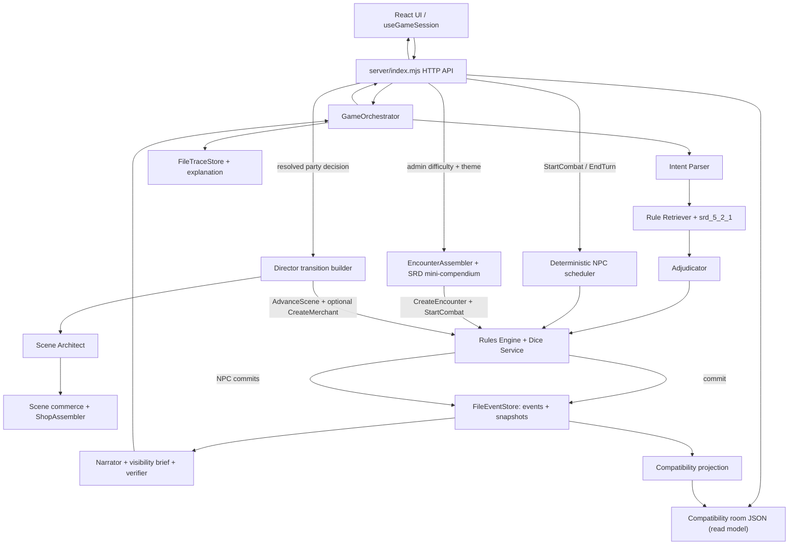

# Текущая архитектура

Дата среза: 25 июля 2026 года.

## Краткий вывод

Приложение работает в единственном режиме **`enforce`**. Авторитетная механика выполняется Rules Engine на сервере и фиксируется в `FileEventStore`; JSON room сохранён только как server-owned read-модель для текущего React UI.

Исполняемые ветки `legacy` и `shadow`, legacy narrator/tools, browser gameplay fallback и broad room `PUT` удалены. Старые значения режима при чтении нормализуются в `enforce`, но не могут включить иной runtime. Любая новая кампания создаётся непосредственно в Event Store.

Cutover кода завершён, но перенос существующих данных отделён от него: перед подтверждением проекции сервер сравнивает канонический SHA-256, а `cutover:verify` останавливает миграцию при расхождении room, snapshot и replay. Текущее локальное хранилище имеет такие расхождения, поэтому оно намеренно не переписано.

## Runtime-схема



Event Store обязателен для любого игрового хода. Compatibility room обновляется только серверной проекцией после commit и не является источником механики.

## Точки входа

### Frontend

- `src/main.tsx` создаёт React root.
- `src/App.tsx` содержит основной экран, карту, чат, персонажей, торговца и admin UI. В `enforce` карта показывает initiative ribbon, merchant screen — серверные buy/sell quotes, кассу NPC и действие оценки нестандартного предмета без локальной механической мутации, а admin-раздел — ограниченные difficulty/theme controls EncounterAssembler и результат собранного roster.
- `src/useGameSession.ts` загружает read-модель, вызывает narration/roll/command API и принимает только авторитетный результат сервера. Ошибка API показывается пользователю и не запускает локальную механику.
- `src/game-engine.ts` содержит только presentation helper для сообщения игрока; механики и RNG в нём нет.
- `src/auth-client.ts` и `src/ai-client.ts` адаптируют browser calls к существующим contracts.

Frontend является UI/read-model adapter. Он не отправляет полный state и не рассчитывает результат боя, проверки, NPC-хода или броска.

### HTTP-сервер

`server/index.mjs` остаётся единым `node:http` composition root. Отдельного framework router нет, но server startup реально связывает доменные зависимости. Основные маршруты:

| Маршрут | Подключённый контур |
|---|---|
| `GET /api/health` | RouterAI configuration, фиксированный `enforce`, ruleset и число правил |
| auth/admin routes | `server/store.mjs`: пользователи, scrypt, sessions, hero access |
| `GET /api/rules/search` | Rule Retriever; auth и строгая фильтрация ruleset/enabled packs |
| `POST /api/campaigns` | Admin-only создание кампании непосредственно в Event Store |
| `PATCH /api/campaigns/:id/engine-mode` | Retired endpoint: всегда `410 ENGINE_MODE_RETIRED` |
| `POST /api/campaigns/:id/commands` | Игрок — разрешённый typed набор за назначенного героя; admin — расширенный typed набор. Затем Rules Engine → event commit → при необходимости NPC scheduler → room projection |
| `POST /api/campaigns/:id/encounters/assemble` | Admin-only: bounded `difficulty/theme` → server-owned EncounterAssembler → атомарные `EncounterCreated + CombatStarted` → NPC scheduler/replay → viewer projection |
| `GET /api/campaigns/:id/turns/:turnId/explanation` | Trace lookup и `buildTurnExplanation`; `latest` разрешён |
| `GET /api/rooms/:code` | ACL-protected compatibility read model; при необходимости reconciliation по hash |
| `PUT /api/rooms/:code` | Retired endpoint: всегда `410 ROOM_MUTATION_RETIRED` для доступной кампании |
| `POST /api/rooms/:code/dice` | `DiceService` → `PublicDieRolled` → Event Store → projection |
| `POST /api/roll` | `RollRegistry.issue` для серверного `roll_id` |
| `POST /api/narrate` | Campaign ID, action и optional `roll_id`; trusted Event Store state, verified roll consume и `GameOrchestrator` |
| merchant routes | Публичная витрина/quotes/касса, player bargain/appraise/buy/sell, admin lifecycle и ручной `ShopAssembler`; все изменения проходят Rules Engine и FileEventStore |
| image routes | Authenticated generation/read; per-user generation rate limit |

Любой неизвестный `/api/*` получает JSON 404. Остальные пути обслуживаются из `dist` как SPA.

## Обработка `/api/narrate`

1. Сервер проверяет сессию, доступ к кампании и владение активным героем.
2. Поля `state`, `player` и engine mode в body отклоняются как retired payload; сервер загружает кампанию сам.
3. Per-user rate limit проверяется до дорогой работы.
4. Переданный `roll_id` потребляется через `RollRegistry` с проверкой campaign, actor и idempotency; произвольный клиентский roll запрещён.
5. Сервер проверяет, завершено ли сохранённое групповое решение. Если оно требует перехода, server-owned Director flow строит `AdvanceScene` и при необходимости `CreateMerchant`.
6. Для остальных действий `GameOrchestrator` строит видимую проекцию, intent, retrieval queries и adjudication plan.
7. Команды валидируются, события коммитятся идемпотентно, Narrator получает ограниченный brief, verifier проверяет narration.
8. Authoritative state проецируется в room JSON; outbox подтверждается только после совпадения канонического hash.

Команда `/why` возвращает объяснение последнего или указанного trace, не выполняет новый ход и устанавливает `turn_consumed: false`.

Если RouterAI key отсутствует, deterministic Narrator сохраняет работоспособность structured command path без внешней модели.

## Обработка перехода сцены в `enforce`

1. Источником запуска служит resolved `agentInteraction`; открытие, голоса/общий d20, итог и consumption сохраняются отдельными событиями FileEventStore.
2. `SceneArchitect` выдаёт ограниченные параметры назначения и карты. `director-scene-transition.mjs` нормализует их, строит semantic fingerprint от campaign/action и канонический `AdvanceScene`.
3. `scene-commerce.mjs` сводит предложение Директора к versioned плану: `create|none`, allowlisted settlement/theme, bounded budget и причина. Локацию, seed, merchant ID, persona, stock и цены агент не задаёт.
4. Для поселения `ShopAssembler` создаёт каталожный proposal; если торговец с той же нормализованной строкой локации уже существует, он повторно используется без сброса stock. Для wilderness постоянная лавка по умолчанию не создаётся.
5. `AdvanceScene` и optional `CreateMerchant` разрешаются последовательно и попадают в один commit как `SceneAdvanced` и `MerchantCreated`. Команда запрещена при активном бое и недоступна через generic typed-command endpoint.
6. Reducer заменяет карту, переносит отряд на уникальные проходимые клетки у входа, очищает прежних enemies/entities/map feedback/combat, закрывает party interaction и обновляет adventure history. `scene-narration.mjs` рассказывает только по committed transition/arrival/merchant events.
7. `SceneAdvanced` фиксирует `interaction_id + resolved_option_id`. Параллельное исполнение одного решения сериализуется: победитель коммитит переход, второй ключ получает `409 PARTY_DECISION_ALREADY_CONSUMED`.
8. Retry победившего idempotency key читает committed batch напрямую, не вызывает Scene Architect/LLM повторно и возвращает прежний deterministic результат; повторное использование ключа для другого перехода получает `409`.
9. Player response проходит viewer projection, а реплика перехода получает стабильный message ID и сохраняется в compatibility journal вместе с room projection.

Сцена и узел `worldMap` теперь получают устойчивый `location_id`: `SceneAdvanced` переиспользует по нему сохранённую тактическую карту и её event-sourced изменения. Ограничение остаётся в экономическом compatibility-пути: поиск торговца пока дополнительно допускает нормализованную строку локации, поэтому одноимённые разные места могут переиспользовать одного NPC, а переименование — создать второго.

## Сборка встречи в `enforce`

1. Администратор выбирает в UI только сложность `easy|medium|hard` и одну из пяти
   тем `generic|goblinoids|undead|beasts|raiders`. Серверный endpoint и Director
   дополнительно принимают `warband|vermin|ambush|crypt|cave|wilderness`; всего
   allowlist содержит 11 тем. Endpoint также требует viewed state version и
   idempotency key. `CreateEncounter` через общий typed-command route запрещён.
2. Сервер загружает авторитетные карту, живых героев, их уровни и позиции. Присланные stat blocks, HP, КД, атаки, XP, participants или координаты не входят в контракт и отклоняются.
3. `EncounterAssembler` считает официальный SRD 5.2.1 XP Budget per Character для каждого уровня 1–20 и выбирает в пределах бюджета и quantity cap одну или несколько записей из 50 server-owned профилей. Intent агента/администратора ограничен только allowlisted difficulty/theme; числовые профили он не сочиняет.
4. Размещение допускает только раскрытые проходимые клетки, достижимые из области группы ортогональным путём, без feature/occupancy и не ближе двух клеток — 10 футов — от каждого героя. Seed ограничен и используется для воспроизводимого выбора и tie-break, а не как текстовая инструкция.
5. Rules Engine повторно выводит proposal из авторитетного state и фиксирует `EncounterCreated` вместе с `CombatStarted` одним commit. Initiative включает только живых героев и enemy IDs созданной встречи; reducer сохраняет encounter registry, противников, позиции и combat state.
6. После commit используется тот же bounded NPC scheduler. Event replay восстанавливает встречу и бой, а tactical narration строится только из committed events.
7. Player projection оставляет видимые имя, HP, КД, скорость, координаты и `stat_block_id`, но не выдаёт внутренний provenance/source payload. Admin response сохраняет полный proposal для диагностики.

Это mini-compendium из 50 профилей, а не полный monster corpus. Он хранит локальные миниатюры, несколько атак и ограниченные исполняемые traits/особые действия, включая pack tactics, nimble escape, aggressive, martial advantage, surprise attack, undead fortitude, multiattack, charge, bloodied frenzy, keep distance, relentless pursuit, poison, prone и web. В нём нет полной модели saves/skills, resistances/immunities, spellcasting, legendary/lair actions, recharge, loot или rewards. Ручной admin flow пока не подключён автоматически к Director/scene transition.

## Обработка боевой команды в `enforce`

1. Сервер проверяет session, campaign ACL и effective `enforce` mode.
2. Для non-admin применяется отдельный allowlist из четырёх команд и проверяется владение героем. Атаковать таким путём можно только живого противника из `state.enemies`.
3. Клиентская команда сокращается до доверенного минимума: type, actor ID, target ID либо destination и expected version. Сервер заново выводит участников боя, attack profile, AC, damage, advantage/disadvantage, range и provenance из сохранённого состояния.
4. `RulesEngine` использует общий actor lookup `players + actors + enemies`, проверяет очередь, жизнь участника/цели, action, ортогональный путь по проходимым клеткам, стены, occupancy, скорость и уже потраченное movement.
5. События идемпотентно коммитятся в FileEventStore; reducer обновляет HP/`alive`, позиции, initiative/action economy, `activePlayerId`, `tacticalTurn`, `battleLog` и `mapFeedback`.
6. После `StartCombat` или `EndTurn` bounded scheduler последовательно обрабатывает server-owned enemies до следующего живого PC. Он детерминированно оценивает допустимые сочетания цели и действия, дальность, ожидаемый урон, шанс добивания, КД, контроль и поддержку союзников, затем двигается, применяет выбранное умение/атаку и завершает ход; побеждённые пропускаются, а бой заканчивается при поражении стороны. Dice при этом остаются серверными.
7. Сервер загружает итоговый replay state, строит тактическую реплику только по committed events, сохраняет её идемпотентно вместе с compatibility journal, проецирует state в legacy room и возвращает `authoritative_state`, объединённые mechanics, `npc_turns` и room version. UI отдельно отображает структурированный `battleLog` как «Боевую хронику».

Этот цикл умеет продолжить встречу, созданную EncounterAssembler, но не является полным Tactical Controller: решения NPC остаются bounded rule-based policy без LLM, долгосрочного планирования, spellcasting и полной модели реакций/окружения. Multiattack исполняется поэтапно и остаётся одним Attack action.

## Обработка торговли в `enforce`

1. UI запрашивает витрину для выбранного доступного героя и NPC в текущей локации.
2. Сервер загружает latest event state и возвращает публичную persona, кошелёк героя, `merchant_purse_cp`, stock, server-derived buy/sell quotes и `expected_state_version`.
3. Клиент отправляет только `BargainWithMerchant`, `AppraiseItem`, `BuyItem` или `SellItem`, идентификаторы, количество при сделке, viewed version и idempotency key. Цена, appraisal policy и валютная дельта в контракт не входят.
4. `merchant-economy.mjs` разрешает `catalog_id`, доверенную event-sourced appraisal attestation, базовую цену/provenance, bounded basis-point policy, ликвидность кассы и sellability. `item-appraisal.mjs` детерминированно выводит bounded цену из server-owned категории/редкости/состояния. `RulesEngine` проверяет ACL actor scope, присутствие NPC, отсутствие боя, stock/funds/quantity/version и выполняет серверный бросок торга.
5. `MerchantItemAppraised` записывает fingerprinted аттестацию в `mechanics.item_appraisals`. Один `MerchantPurchaseCompleted` либо `MerchantSaleCompleted` атомарно меняет кошелёк героя, кассу торговца, инвентарь и stock; bargain хранится отдельно для пары герой–торговец. Reducer добавляет соответствующую запись в bounded `economyLog`.
6. FileEventStore обеспечивает optimistic locking, semantic request fingerprint, durable idempotency и replay. Compatibility projector переносит currency/inventory/merchants/mechanics/economy log в room, после чего UI заменяет состояние authoritative response.

Автоматическая базовая лавка в поселении работает со стартовой кассой, услугой и расписанием пополнения; нестандартный предмет можно оценить через server policy. NPC dialogue, relationships и расписания persistent, а economy clock использует время кампании. Это всё ещё не полная городская экономика: нет theft, supply/demand и механических эффектов специализированных услуг; appraisal пока не идентифицирует магические свойства и считает состояние предмета `serviceable`.

## Модули и их фактический статус

| Модуль | Реализовано и подключено | Остаточное ограничение |
|---|---|---|
| `contracts.mjs` | Общие LLM, rule, campaign, event и snapshot contracts | Не все доменные границы выражены отдельными интерфейсами |
| `engine-mode.mjs` | Единственный исполняемый `enforce`; старые значения только нормализуются при чтении | Модуль сохранён для обратного чтения старых metadata |
| `llm-client.mjs` | Timeout, error taxonomy, JSON/tool validation, allowlist; используется text paths | Image generation остаётся отдельным provider call |
| `rule-pack.mjs` | Строгая загрузка, schema и numeric integrity | Один минимальный pack; нет подписанного registry packs |
| `rule-retriever.mjs` | RU/EN lexical, aliases, typo tolerance, local vector/ontology и filters | Нет внешних embeddings, production metrics и полного корпуса |
| `intent-parser.mjs` | Реально вызывается orchestrator | Ограниченный rule-based набор intents |
| `adjudicator.mjs` | Формирует plans/rulings для orchestrator | Неполное P0/P1 покрытие и workflow утверждения ruling |
| `dice-service.mjs` | Все игровые броски выполняются сервером через crypto/default RNG | Не обеспечивает распределённую координацию нескольких процессов |
| `roll-registry.mjs` | Durable issue/register/consume и повтор consume по idempotency | File adapter рассчитан на single-writer, не multi-process |
| `rules-engine.mjs` | Command validation, общий lookup героев/actors/enemies, trusted combat profile, `CreateEncounter`, path/range/turn/action checks, базовый death-save/stabilization lifecycle с 1d4-hour stable recovery, Bless/Bane, Beacon of Hope, Death Ward, позиционные Aura of Life и Aura of Protection, Fighter Indomitable 9–12 с атомарной паузой/перебросом любого failed save, Resistance 2024, автоматический Constitution save концентрации из общего damage pipeline, trusted-melee nonlethal knockout с Short Rest/лечением/первой помощью, `AdvanceScene`, appraisal/торговые события, атомарная касса и reducer/replay; авторитетен в `enforce` | Нет диагоналей, cover/LOS, полной weapon/spell semantics, всех condition effects, полного rest recovery, всех внешних причин окончания концентрации и оставшегося корпуса save/death features до 12 уровня |
| `campaign-loop-policy.mjs` / `autonomous-orchestrator.mjs` | Server-owned pacing, travel time/risk, random encounter trigger, bounded social NPC assembly, downtime, rewards и исполнение расписаний NPC при автономном переходе; Director передаёт только narrative intent | Таблицы тем, NPC и loot намеренно ограничены текущим вертикальным срезом |
| `encounter-assembler.mjs` | Официальный SRD 5.2.1 XP budget уровней 1–20, 50 server-owned monster profiles с изображениями, несколькими атаками и ограниченными traits, bounded difficulty/theme, deterministic selection, автоматический Director/random-travel trigger и безопасные revealed/reachable spawn cells не ближе 10 футов | Mini-compendium не содержит полного corpus, полной модели saves/resistances, spellcasting и legendary/lair/recharge |
| `encounter-narration.mjs` | Детерминированная реплика только по committed `EncounterCreated`/`CombatStarted` | Не создаёт механические факты и не заменяет полноценное описание существ/тактики |
| `merchant-economy.mjs` | Versioned price allowlist, currency conversion, services, restock clock, canonical location identity, bounded purse/quotes/sellability и public projection | Малый catalog; нет EP, theft, supply/demand и механических эффектов специализированных услуг |
| `item-appraisal.mjs` | Строгий allowlist descriptor, category/rarity/condition formula, bounded CP, provenance и SHA-256 fingerprint | Это price policy, а не идентификация магии; merchant path пока фиксирует `serviceable` |
| `scene-commerce.mjs` / `director-scene-transition.mjs` | Bounded commerce intent, semantic fingerprint, event-sourced party decision, atomic `SceneAdvanced` + optional `MerchantCreated`, canonical `location_id`, защита server-only capability | Полная географическая маршрутизация между далёкими регионами остаётся server-policy approximation |
| `shop-assembler.mjs` | Детерминированные persona/stock/service/restock policy/стартовая касса из server-owned catalog, settlement/theme/budget limits | Базовая лавка; нет supply/demand и специализированной городской симуляции |
| `scene-narration.mjs` | Детерминированно объединяет committed transition, arrival и созданного торговца | Не является полноценным автономным рассказчиком сцены или NPC dialogue engine |
| `npc-social.mjs` / `npc-social-check.mjs` / `npc-social-controller.mjs` | Persistent NPC, bounded social assembly, приватные профили, server-owned проверки, отношения, обещания, faction witnesses/reputation, расписания и replay/player projection | Ограничены разнообразие social templates и влияние репутации на полный набор политик мира |
| `npc-turn-scheduler.mjs` | Bounded deterministic enemy policy с оценкой цели/действия, дистанции, урона, контроля и поддержки союзников; phased multiattack, именованные повадки, отдельные идемпотентные commits, skip defeated и auto-end до следующего PC | Нет LLM Tactical Controller, долгосрочных целей, spellcasting, полной модели reactions/cover/height/environment, loot/rewards |
| `event-store.mjs` | Immutable commits, optimistic version, durable idempotency, snapshots/checksums, replay и явный offline import | File adapter ориентирован на один процесс; room projection не в одной транзакции |
| `game-orchestrator.mjs` | Enforce-only точка сборки intent, retrieval, adjudication, engine, narration и trace; принимает Director capability только как серверный `Symbol` | Intent coverage ограничен |
| `security.mjs` / `viewer-projection.mjs` | Command allowlist, visible-state projection, player projection room/commands/narrate, публичные enemy/encounter поля без внутреннего source/provenance, narration brief, delimiters и verifier | Explanation endpoint не перепроецирует каждое событие по visibility |
| `narrator.mjs` | LLM или deterministic narration после commit; verifier подключён | Не является полнофункциональным NPC/scene simulator |
| `trace-store.mjs` | Активная запись trace, redaction, `/why` и explanation | File storage; campaign ACL есть, тонкая event visibility выдачи отсутствует |
| `migrations/001-event-engine.mjs` | Dry-run, точная `.bak`, idempotent metadata update | Runner не объединён с event import, mode switch и очисткой migration marker в одну операцию |

Версионированные prompts находятся в `prompts/<role>/v1.txt`; trace фиксирует версии intent parser, adjudicator, narrator и verifier, когда они применимы.

## Состояние и persistence

### Compatibility room/read model

```text
storage/rooms/<code>.json
  version
  state = совместимый GameState
  updatedAt
```

`version` используется для optimistic conflict detection проектора. Клиент может только читать эту модель: `PUT /api/rooms/:code` retired и возвращает `410`. Единственный writer — серверная проекция авторитетного event state; transient presence не входит в канонический hash.

### Event state

```text
<DND_STORAGE_DIR>/engine/
  immutable commit batches
  idempotency metadata
  checksummed snapshots
```

`normalizeCampaignState` добавляет ruleset lock, `state_version` и разделы `mechanics`. Новые кампании инициализируются непосредственно в Event Store. Старые данные разрешено импортировать только явно и offline после backup и успешной replay/hash-сверки.

`persistAuthoritativeProjection` строит полную server-owned read-модель. Event commit и room-файл не являются одной физической транзакцией, поэтому используется durable projection outbox/checkpoint; acknowledgement выполняется только после совпадения канонического SHA-256. Startup и room GET выполняют reconciliation.

### Остальные данные

- `<DND_STORAGE_DIR>/auth.json` — пользователи, password/session hashes и hero IDs;
- `<DND_STORAGE_DIR>/turn-traces/<campaign>` — redacted turn traces;
- `<DND_STORAGE_DIR>/generated/items` — generated images;
- browser `localStorage` — только локальные UI-настройки, не источник механики.

Путь generated images теперь следует `DND_STORAGE_DIR`; прежнее ограничение о жёстко заданном project storage устранено.

## Правила и provenance

Pack `data/rule_packs/srd_5_2_1` содержит 23 двуязычных оригинальных пересказа, 25 glossary terms, 23 ontology edge, manifest и coverage metadata. Он загружается при старте и используется `/api/rules/search` и orchestrator retrieval. Rules Engine ссылается на существующие IDs pack; известного ID mismatch нет.

В `enforce` события несут `source_rule_ids` или `ruling_id`, trace хранит retrieval, план, commands, rolls, events и versions. Это даёт provenance для реализованного среза, но не превращает минимальный corpus в полное покрытие SRD.

## Случайность

| Путь | RNG/registry | Статус |
|---|---|---|
| `/api/rooms/:code/dice` | `DiceService` default crypto | `PublicDieRolled` коммитится в Event Store |
| `/api/roll` | `RollRegistry` → `DiceService` | Активен; выдаёт проверяемый `roll_id` |
| Rules Engine | Инъецированный `DiceService` | Авторитетен для всех поддержанных механик |
| Tactical UI | Typed command → Rules Engine `DiceService` | Сервер авторитетен для initiative/attack/damage |

Browser gameplay RNG удалён. Остаточный риск — отсутствие распределённой блокировки Roll Registry между несколькими процессами и общей транзакции consume + event commit.

## Auth и runtime security

Активные меры:

- `scrypt`, timing-safe comparison, случайные session tokens и только их SHA-256 hashes на диске;
- `HttpOnly`, `SameSite=Lax`, conditional `Secure` cookie;
- server-only RouterAI key;
- room ACL через admin role или назначенного героя в roster;
- actor ownership и command allowlist;
- trusted server state для narration;
- auth для rule search, rooms, generated files и AI endpoints;
- same-host/localhost Origin check для mutating methods;
- CSP, `X-Content-Type-Options`, Referrer/Permissions Policy и CORP;
- body size limit, auth-attempt rate limit и per-user narration/image limits;
- prompt data delimiters, state visibility projection, deterministic narration verifier и trace redaction.

Ограничения:

- self-registration открыта;
- Origin-less requests разрешены, отдельного CSRF token нет;
- rate-limit maps находятся в памяти; файловый Roll Registry не координирует несколько процессов;
- hero assignment служит membership model, отдельной сущности campaign membership нет;
- compatibility PUT удалён; для сохраняемых presentation-изменений нужны отдельные типизированные команды;
- explanation route применяет campaign ACL, но не отдельную visibility projection к каждому trace event;
- CSP разрешает только self styles, поэтому внешний Google Fonts import может не загрузиться;
- нет durable token/cost quota RouterAI, только request-count limits.

## Проверенная область

Актуальный suite включает unit tests доменных модулей, event-store reopen/replay, migration dry-run/backup/idempotency, enforce-only orchestrator, security, viewer projection, narrator, trace и cutover audit.

Дополнительно `test/game-flow-integration.test.mjs` проверяет связанный domain flow от legacy import через исследование, ruling, check/save, spell, бой, лечение, condition и rest до reopen/replay и `/why`.

Real-HTTP integration scenarios запускают настоящий `server/index.mjs` на временном storage. Они проверяют создание enforce-кампании, retired endpoints, строгий `/api/narrate` payload, rule search, damage, idempotent retry, explanation и API 404. Отдельные flows проверяют бой, торговлю, EncounterAssembler, NPC scheduler, player projection/replay и Director → `SceneAdvanced` → `ShopAssembler`.

Не заявлено автоматизированное multi-browser E2E, RouterAI с реальным ключом, успешная миграция рабочего storage, rollback rehearsal, публичный tunnel, multi-process или нагрузочный сценарий. Кодовый cutover завершён, но data cutover не считается завершённым до зелёного `cutover:verify`.
