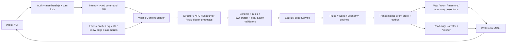

# Аудит готовности «Сказания» как замены ведущего и виртуального стола

Дата аудита: 13 июля 2026 года.

> **Обновление 25 июля 2026:** разделы исходного аудита ниже сохраняют
> исторические формулировки этапов 1–7. Этап 8 удалил исполняемые
> `legacy/shadow`, browser gameplay fallback и broad room write. Актуальный
> статус и незавершённый data cutover описаны в разделе «Этап 8» и
> `docs/legacy-retirement.md`.

## Итог

«Сказание» — уже не пустой макет. Это сильный вертикальный MVP: есть красивый игровой интерфейс, аккаунты, кампании и комнаты, карта, листы героев, CRUD-инвентарь, серверные броски, частичный Rules Engine, event store с replay, Rule Retriever и несколько раздельных ролей ИИ.

Однако проект пока нельзя честно называть полной заменой ведущего и игрового стола. На момент первичного среза главная причина была не в отсутствии ещё одного экрана, а в разделённой архитектуре:

- наиболее выразительный свободный рассказчик и многие world tools живут в `legacy/shadow`-пути, где LLM и браузер всё ещё влияют на состояние; подтверждённый переход группы между сценами уже имеет отдельный событийный путь в `enforce`;
- детерминированный `enforce`-путь покрывает вертикальные срезы боя, встречи, перехода сцены, merchant/economy, долговременной памяти мира и persistent NPC с серверными социальными проверками, отношениями и обещаниями; фракции, свидетели, расписания и широкая социальная симуляция ещё не закрыты;
- видимый бой на карте выполнялся отдельным браузерным движком, а не серверным Rules Engine.

После аудита базовый видимый бой и подтверждённая смена сцены в `enforce` переведены на серверные команды и события; подробный статус приведён ниже. Разделение всё ещё существует в `legacy/shadow`, а многие подсистемы отсутствуют. Поэтому текущая точная формулировка продукта: **играбельный демонстрационный MVP кооперативной RPG с частично авторитетным серверным ядром**, но ещё не автономный D&D-compatible VTT/GM.

## Что проверено

- `pnpm verify` объединяет актуальный test suite, TypeScript-проверку и production build;
- `pnpm test:coverage` измеряет покрытие server/domain кода; точные проценты следует брать из последнего запуска, а не фиксировать в аудите;
- браузерный путь: первоначальная настройка, повторный вход, загрузка комнаты, движение на карте, переход подземелье → город и город → город, majority vote, автоматическая лавка, server quote/покупка, reload/persistence журнала и сцены, лист героя, инвентарь и управление миром;
- локальная тестовая копия запускалась в отдельном временном storage и без ключа RouterAI;
- официальный ориентир правил: SRD 5.2.1, опубликованный по CC-BY-4.0;
- dependency audit: известных production-уязвимостей в установленном lockfile не найдено.

Существенное ограничение проверки: рабочее дерево не имеет ни одного Git commit, поэтому нет зафиксированного baseline/tag для надёжного сравнения и rollback.

## Реализовано после аудита / статус этапа 2

После первичного среза реализована **часть**, но не весь критерий этапа 2:

- в `enforce` обычный игрок может отправить только `StartCombat`, `MoveActor`, `MakeAttack` и `EndTurn` от имени назначенного ему героя; расширенные структурированные команды остаются административным контуром;
- сервер сам выводит живых участников инициативы, профиль атаки, AC цели, формулу/тип урона и дальность из сохранённых сущностей; подставленные клиентом `participants`, модификаторы, AC, damage expression, advantage/disadvantage и сходные overrides не являются источником истины;
- `players`, дополнительные `actors` и `enemies` входят в общий actor lookup. Reducer обновляет HP/`alive`, позиции, action economy, `activePlayerId` и `tacticalTurn` для героев и противников;
- ортогональное перемещение проверяет карту, стены, занятые клетки, существование пути, скорость и уже потраченное в ходу перемещение. Атака проверяет очередь хода и дальность;
- ограниченный детерминированный NPC scheduler выбирает ближайшего достижимого героя, при необходимости двигается и атакует, пропускает побеждённых участников, выполняет серверные ходы до следующего живого PC и автоматически завершает бой при поражении стороны. Он не вызывает LLM на каждого противника;
- UI в `enforce` отправляет эти команды без оптимистической механической мутации, показывает инициативу, раунд, текущего участника и остаток action/movement; `legacy/shadow` по-прежнему используют прежний browser path с `Math.random`;
- `state`, `battleLog` и `mapFeedback` формируются событиями, сохраняются в FileEventStore, проецируются в room и восстанавливаются replay. Real-HTTP тест проходит обычного игрока, вражеский ход, идемпотентный повтор и перезапуск процесса;
- сервер составляет тактическую реплику только из committed events, сохраняет её без дублей по idempotency key, а UI показывает структурированный `battleLog` отдельной «Боевой хроникой»; дальняя цель в интерфейсе блокируется до допустимой дистанции;
- для non-admin compatibility `PUT` в `enforce` сервер восстанавливает из event store `enemies`, `mechanics`, механические поля игроков, tactical turn, battle log/map feedback и клетки карты, принимая у игрока только ограниченные presentation-поля листа. Event commit содержит projection-outbox marker, а monotonic checkpoint и reconciliation при старте/GET восстанавливают room после сбоя между commit и projection; broad narrative/admin compatibility writes пока остаются отдельной поверхностью.
- администратор в `enforce` может через UI/API выбрать bounded сложность и тему; EncounterAssembler считает официальный XP Budget per Character SRD 5.2.1 для уровней 1–20 и выбирает roster из 12 server-owned профилей с несколькими атаками и ограниченными traits;
- статблоки, HP, КД, атаки, XP, participants и координаты не принимаются от клиента/агента. Spawn разрешён только на раскрытых проходимых клетках, достижимых от группы, без feature/occupancy и минимум в 10 футах от каждого героя;
- `EncounterCreated` и `CombatStarted` входят в один commit; initiative ограничена героями и enemy IDs новой встречи, reducer/replay восстанавливает encounter/combat state, scheduler продолжает ходы NPC, а player projection удаляет внутренний source/provenance.

Server-authoritative combat vertical slice этапа 2 завершён: 12 server-owned
профилей имеют несколько действий и bounded traits, EncounterAssembler
автоматически вызывается автономным Director flow, Rules Engine проверяет
движение/траекторию/дальность/экономику хода, а Tactical Controller выбирает
профиль, цель и путь только из серверных возможностей. Автоматические
завершение боя, XP, loot и post-combat recovery сохраняются событиями.
Сквозной тест проводит 4 PC против минимум 3 NPC от spawn до loot,
перезапускает сервер после уже совершённой атаки и проверяет `roll_id`,
`command_id`, `source_rule_ids`, HP before/after и точный replay.

Это не утверждение о полном monster corpus всей D&D. За пределами bounded
критерия этапа остаются legendary/lair actions, широкий monster spellcasting,
высоты, cover, сложная местность, размеры существ и редкие исключения условий.

## Реализовано после аудита / merchant economy slice

- в текущей локации доступен отдельный экран торговца с карточкой NPC, кошельком героя, кассой NPC, вкладками покупки/продажи, количеством, stock, расшифровкой цены и явным итогом `цена за единицу × количество` до подтверждения команды;
- серверный каталог фиксирует базовые SRD 5.2.1 цены и provenance; известный `catalog_id` перекрывает присланный или сохранённый snapshot price;
- `AppraiseItem` принимает только `item_id` и создаёт `MerchantItemAppraised`: bounded server policy выводит цену нестандартного предмета из категории/редкости/состояния, сохраняет fingerprinted аттестацию в mechanics registry и игнорирует поддельные price/policy/appraisal fields;
- политика торговца и агентская поправка хранятся в basis points и ограничены кодом. Одна попытка торга использует серверный d20 и сохранённую Харизму героя; браузер не передаёт результат;
- `BargainWithMerchant`, `AppraiseItem`, `BuyItem` и `SellItem` проверяют campaign ACL, владение героем, `enforce`, локацию, доступность NPC, отсутствие активного боя, версию котировки, деньги обеих сторон, stock, количество и sellability;
- покупка/продажа одним event меняет валюту героя, `merchant.purse_cp`, инвентарь и склад; недостаток кассы ограничивает `max_quantity` и отклоняет выкуп до любых изменений. Idempotency, semantic command fingerprint, optimistic conflict и replay используют тот же FileEventStore, а `economyLog` сохраняет bounded контекст для UI и будущих агентов;
- клиент не делает optimistic mutation и при `409` требует заново получить котировку;
- Rule Pack расширен до 22 записей, включая две economy rules и Aura of Protection; обязательная CC-BY-4.0 атрибуция и hash проверенного SRD PDF зафиксированы.
- resolved групповое решение в `enforce` теперь проходит server-owned цепочку Director → Scene Architect → `AdvanceScene`; `SceneAdvanced` сохраняет новую карту, adventure history и позиции отряда, очищая прежний encounter;
- bounded `scene_commerce` распознаёт поселение и вызывает `ShopAssembler`; `SceneAdvanced` и optional `MerchantCreated` входят в один commit с общим semantic fingerprint. Wilderness не получает постоянную лавку по умолчанию;
- клиент не может прислать `AdvanceScene` через generic command API или подделать Director capability; одно resolved party decision исполняется exactly once при конкурентных ключах, победивший retry не вызывает картографа повторно, а повтор idempotency key с другим переходом получает конфликт;
- при возврате в ту же нормализованную строку локации существующий торговец и его stock повторно используются.

Это ещё не полная городская экономика. Event-sourced merchant lifecycle, услуги, ограниченная касса, детерминированный `ShopAssembler`, NPC relationships/расписания и economy clock работают; мастер может запустить сборку вручную, а Директор автоматически включает её в подтверждённый переход к распознанному поселению. Party vote/roll/resolution теперь хранятся в FileEventStore, а повторный вход связывается устойчивым `location_id` с fallback для старых snapshot. Theft, supply/demand и механические эффекты отдельных видов услуг пока отсутствуют. Appraisal остаётся ценовой формулой, а не идентификацией magic item или проверкой состояния. Полный контракт и граница доверия описаны в `docs/economy-contract.md`.

Важно для cutover: переключение кампании из `shadow` в `enforce` делает дальнейшие торговые операции авторитетными, но не доказывает происхождение уже импортированных денег, инвентаря, stock и policy. До миграции эти поля могли изменяться legacy-клиентом, LLM-tools или административным broad write. Production-cutover требует отдельной сверки начального economy snapshot; event replay гарантирует воспроизводимость только после принятой точки доверия.

## Реализовано после аудита / world-memory slice

- добавлены канонические entities, immutable facts с supersedes, relationships,
  per-character knowledge ledger, quests, narrative threads и bounded clocks;
- truth отделена от NPC beliefs/rumors: epistemic claims имеют holder, visibility,
  truth status и source provenance, а NPC может раскрыть только принадлежащий ему claim;
- изменения проходят только через типизированные admin/director commands, канонические events, reducer и replay;
- новая кампания сразу получает стартовую локацию и активный квест; legacy scene/adventure детерминированно мигрируют в ту же схему при нормализации;
- подтверждённый `SceneAdvanced` атомарно записывает прежнюю и новую локации,
  outcome, arrival, завершает/сохраняет прежний квест, открывает квест новой
  главы и создаёт scene summary с устойчивым source event ID; завершение
  кампании создаёт связанный session summary;
- игрок получает персональную проекцию: public/party данные и только факты, открытые его герою; скрытые факты и связанные с ними сущности другим героям не выдаются;
- Worldkeeper сначала ограничивает кандидатов campaign/visibility/time, затем
  использует детерминированный semantic-like ranking; он не изменяет мир и не
  расходует ход;
- единый bounded `campaignConcept` с premise/tone/boundaries входит в контекст
  Director, Scene Architect, NPC controllers, Narrator, legacy Game Master path
  и Worldkeeper;
- тесты проверяют replay, запрет player-forgery, unknown fields, superseding
  facts, private-knowledge isolation, time filter, claim ownership, summaries,
  reconnect и обход LLM.

Persistent NPC теперь имеют изолированные relationships, историю разговоров,
обещания с серверными дедлайнами и собственные beliefs/rumors. За пределами
этого этапа остаются фракционная репутация, свидетели, расписания, production
vector database и более широкая автоматическая социальная симуляция.

## Матрица возможностей на момент первичного среза

Матрица и исходные блокеры ниже сохранены как состояние, обнаруженное аудитом. Для актуальных server-authoritative combat, scene-transition, merchant и world-memory slices применяются поправки из предыдущих разделов.

| Возможность | Статус | Фактическое состояние |
|---|---|---|
| Аккаунты и сессии | Частично готово | Регистрация, scrypt-хеши, HttpOnly cookie и администратор работают. Нет полноценной membership/role модели кампании. |
| Комнаты и кампании | Частично готово | Есть persisted room, список кампаний и мастер нового мира. Нет lobby/join-by-code/ready/spectator flow. |
| Совместная синхронизация | Прототип | Polling раз в 1.5 секунды и broad state `PUT`; нет realtime presence, rebase/retry и устойчивого разрешения конфликтов. |
| Тактическая карта | Частично готово | Клетки, фишки, перемещение, zoom и базовый fog есть. EncounterAssembler валидирует revealed/reachable/occupied spawn и дистанцию 10 футов, но нет LOS, cover, per-player vision, измерителя, ping/drawings и общих spawn templates. |
| Лист персонажа | Частично готово | Базовые характеристики, HP, AC, скорость, история, импорт/экспорт. Нет полной модели saves/skills/spells/features/resources/death/concentration. |
| Инвентарь | Частично готово | Команды use/transfer/attunement/equip, вес и merchant stack/remove событийны; versioned instance effects исполняют числовое свойство Кольца защиты. Нет полного item corpus, общего компилятора magic properties и полной схемы обязательных item-полей. |
| Общий журнал | Частично готово | Сообщения, тактические записи и реплика автоматического перехода сохраняются с устойчивым message ID. Это всё ещё не структурированная память канона мира. |
| Серверные кубики | Частично готово | Dice Service и Roll Registry существуют. Часть браузерного боя всё ещё использует `Math.random`, registry недолговечен. |
| Rules Engine | Частичный P0 | Checks, saves, атака, урон, HP, ресурсы, initiative markers и replay реализованы. Полная семантика боя отсутствует. |
| Соответствие D&D/SRD | Частичный корпус | 22 кратких правила, каталог 439 spell-карточек 0–6 круга, классовая прогрессия 1–12, небольшой equipment-price catalog и 12 monster profiles против полного официального SRD; многие карточки ещё не имеют полного исполнимого эффекта, полного monster stat block и всех способностей. |
| Рассказчик | Частично готово | Legacy умеет импровизировать и использовать world tools; enforce рассказывает только по committed events, но получает слишком бедный контекст. |
| Набор агентов | Архитектурный прототип | Роли и prompts есть, но часть не подключена, а единого scheduler/supervisor lifecycle нет. |
| Создание боя агентом | Частично готово для admin | EncounterAssembler создаёт исполнимых combat actors и сразу запускает бой из admin UI/API. Автоматический Director/agent trigger пока не подключён, а произвольный `spawn_entity` по-прежнему не является combat actor. |
| Ходы NPC/врагов | Не готово на сервере | На момент среза упрощённый AI находился в браузере и ходил пакетом после игрока, вне единой initiative. После аудита добавлен ограниченный серверный scheduler; см. актуальный статус выше. |
| Память мира | Частичный vertical slice | Есть event-sourced entities/facts/knowledge/quests/clocks, персональная viewer projection и детерминированный Worldkeeper. Нет relationships, beliefs/rumors, summaries, semantic retrieval и автоматической записи Director/NPC-контроллером. |
| NPC и диалоги | Не готово | `npc_controller` не подключён; устойчивых NPC, целей, памяти, голоса и knowledge scope нет. |
| Города, магазины, торг | Завершённый bounded vertical slice | Есть persistent merchant/NPC schema, event-sourced party decision и merchant lifecycle, canonical `location_id`, bounded ShopAssembler, услуги, NPC relationships/расписания, server catalog/quotes, buy/sell/bargain/appraise, bounded merchant purse, atomic transfer и economy clock. Нет theft/supply-demand и механических эффектов специализированных услуг; appraisal не идентифицирует магию, каталог содержит лишь небольшой allowlist, EP не моделируется, а Persuasion proficiency/expertise не выводятся из полной модели персонажа. |
| Production deployment | Частично готово | Docker/healthcheck/tunnel есть. Нет DB-backed multiwriter, restore rehearsal, observability, durable quotas и production E2E. |

## Исходные блокеры P0

Формулировки в этом разделе фиксируют причины вывода на момент аудита. Часть пунктов 1–3 и 6 закрыта только для узкого боевого пути `enforce`, но сохраняется в `legacy/shadow` либо за пределами реализованного среза.

### 1. Не было единого источника истины

На момент среза три механических контура могли давать разные результаты:

1. `src/tactical-engine.ts` меняет карту/HP и бросает через браузерный `Math.random`;
2. legacy RouterAI tools возвращают effects, которые клиент применяет к комнате;
3. `server/rules-engine.mjs` создаёт события в `enforce`.

После аудита start/move/attack/end-turn в `enforce` сведены к server-authoritative command/event flow. Риск всё ещё существует в `legacy/shadow`, для широких compatibility writes и механик вне этого боевого среза.

### 2. Игроки и враги были представлены разными несовместимыми схемами

На момент аудита UI хранил врагов в `state.enemies`, тогда как `listActors()` Rules Engine, Intent Parser и Adjudicator использовали `players + actors`. Из-за этого реальный enemy из комнаты не являлся валидной целью authoritative атаки или инициативы. После аудита `enemies` включены в actor lookup и reducer, а EncounterAssembler добавил пять server-owned projections с `stat_block_id`; единая полная persisted schema для персонажей, существ, действий и эффектов всё ещё не реализована.

Нужна единая сущность:

```text
Actor {
  id
  kind: pc | monster | npc
  controller: player | npc | system
  stat_block_id
  token_id
  resources
  conditions
}
```

### 3. Боевой цикл не являлся D&D-циклом

На момент аудита видимая атака героя была только melee STR + proficiency + фиксированный d8. Не было выбора оружия, finesse/ranged, advantage, critical path, range, cover, spells, bonus action, reaction, opportunity attack и полноценного condition/death flow. Все враги двигались и атаковали одним браузерным пакетом после каждого героя, а серверный `EndTurn` лишь переставлял индекс и не запускал NPC.

После аудита `enforce`-команды получают trusted attack profile и server path/range/turn checks, а `EndTurn` запускает bounded NPC scheduler. Однако оружие/заклинания, cover/LOS, difficult terrain, диагонали, reactions и полный condition/death flow по-прежнему отсутствуют; `legacy/shadow` browser path не удалён.

### 4. Исполнимая встреча появилась, но ещё не управляется автономным агентом

На момент аудита `spawn_entity` содержал только координаты, тип и label, поэтому не гарантировал появление управляемой боевой фишки. После аудита admin-only EncounterAssembler создаёт `stat_block_id`, HP, AC, initiative modifier, один primary attack, официальный XP budget, безопасное размещение и атомарный старт боя. Блокер закрыт для ручного bounded admin flow, но не для автономного агента: Director integration, tactics profile, полный набор действий, loot и rewards отсутствуют.

### 5. Модель всё ещё может влиять на механику в default flow

Новые кампании стартуют в `shadow`, а default resolver допускает legacy. В этих режимах LLM выбирает DC/world tools, клиент применяет effects и сохраняет broad room state. При переходе в `enforce` существующий snapshot импортируется как исходное состояние: это техническая точка cutover, а не доказательство того, что прежние деньги, предметы, торговцы и их цены были получены авторитетно. Целевой invariant должен быть жёстким:

> LLM предлагает typed intent/command, но никогда не бросает кубики и не меняет HP, карту, предметы или деньги. Изменение делает только валидатор + доменный движок + atomic commit.

### 6. Rule provenance и derived stats не были авторитетны

На момент аудита Rules Engine принимал клиентские/планировочные `attack_modifier`, `damage_expression` и даже override AC. После аудита player combat path санитизирует эти поля и выводит профиль/AC/урон/range на сервере. Полноценные derived stats из versioned character/item/spell/stat-block entities и общий referential-integrity gate для всех административных/orchestrated commands всё ещё нужны.

### 7. Нет настоящей памяти мира

Сохраняются room JSON, события, snapshots и traces, но в prompts попадают в основном текущая сцена и последние сообщения. `campaignConcept` и content boundaries после пролога почти не используются. Нет:

- канонических фактов с provenance;
- локаций, NPC, фракций и отношений как сущностей;
- квестов, незавершённых нитей и clocks;
- отличия истины от слухов/убеждений NPC;
- списка знаний каждого персонажа;
- episodic summaries с ссылками на исходные events;
- retrieval по campaign + visibility + time.

### 8. NPC/social/economy domain остаётся неполным

Persistent NPC controller подключён: социальные события, отношения, обещания, расписание, местоположение и inventory replay-ятся и фильтруются по видимости. Магазины получили server-owned stock/quote, appraisal registry, bounded purse, услуги, purchase/sale, economy clock и авторитетный lifecycle; `ShopAssembler` вызывается Директором для подтверждённого перехода в поселение. Party decision event-sourced, сцены и магазины используют устойчивый `location_id`. Не реализованы theft, supply/demand и механические эффекты специализированных услуг; appraisal пока использует упрощённую server formula. В `legacy/shadow` валюта всё ещё остаётся редактируемым полем листа, а cutover принимает предварительно проверенный snapshot как начальную истину.

## Остаточные риски P1: multiplayer, надёжность и безопасность

- Structured commands повторно валидируются на свежем state после optimistic
  conflict; совместимые narrative/admin whole-state `PUT` всё ещё используют
  CAS и не объединяются автоматически.
- Ошибки typed combat command показываются игроку; общая обработка ошибок room sync остаётся неполной.
- Клиентский cache key всё ещё общий для origin, хотя server SSE stream и
  visibility projection изолированы по кампании и пользователю.
- `online` вычисляется из живых SSE connections; presence пока process-local и
  требует sticky single-writer deployment.
- Event commit и compatibility projection связаны durable outbox marker,
  monotonic checkpoint и startup/GET reconciliation. Narration/trace и consume
  внешнего roll token не входят в одну транзакцию с event commit.
- FileEventStore рассчитан на один процесс; sync filesystem I/O будет блокировать event loop при росте истории.
- Room, command, narrate, SSE и explanation responses проходят viewer/event
  projection; private knowledge проверяется отдельными no-leak тестами.
- Roll Registry durable для одного процесса; rate limits и AI quotas пока
  process-local, нет campaign token/cost budget и kill switch.
- HTTP suite покрывает concurrent players, SSE presence, restart в середине
  боя и crash-between-commit/projection. Не покрыты multiprocess/load,
  real-provider и настоящий browser automation E2E.
- До этого аудита `storage/engine` и `storage/turn-traces` могли попадать в Git/Docker context; исключение всего `storage/` уже добавлено.

## Целевая архитектура



Практический следующий storage target — PostgreSQL с event/outbox/read-model tables. Для локального single-user режима допустим SQLite adapter, но production должен сохранять те же transactional contracts.

### Границы ролей

- **Worldkeeper** — только читает canonical facts и knowledge конкретного персонажа; отвечает с `fact_id/source_event_ids`.
- **Director** — предлагает scene beats, quests и encounter requests; не имеет HP/item/currency tools.
- **Scene Architect** — выдаёт semantic scene graph и constraints; детерминированный Map Compiler проверяет connectivity, входы, выходы, LOS и spawn zones.
- **Encounter Builder** — выбирает только licensed compendium IDs, считает threat budget и размещение; не сочиняет числовой stat block.
- **NPC Controller** — выбирает социальное намерение из целей/убеждений NPC.
- **Tactical Controller** — выбирает только ID из списка legal actions, подготовленного Rules Engine.
- **Adjudicator** — переводит intent в typed commands; низкая уверенность ведёт к clarification/owner-approved ruling.
- **Economy/Shopkeeper** — LLM отвечает за реплику и характер; Economy Engine — за цену, stock, деньги и предметы.
- **Narrator/Verifier** — работают только после commit и ничего не меняют.

## Поэтапный план

### Этап 0. Baseline и защита данных — начат этим аудитом

- исключить весь runtime `storage/` из Git и Docker context — выполнено;
- исправить динамические размеры карты, испорченные UI-строки и базовую доступность модалей — выполнено;
- привести документацию Rule Pack к фактическим 19 правилам — выполнено;
- создать первый baseline commit/tag и внешний backup — требует решения владельца;
- добавить browser characterisation tests текущего happy path.

Критерий завершения: чистый воспроизводимый build, backup, tag и отсутствие секретов/кампаний в distributable artifact.

### Этап 1. Единая авторитетность и multiplayer — завершён для single-writer deployment

- единый `actors` schema;
- command-only writes для механики и controlled character/economy updates;
- explicit campaign membership/roles;
- transactional event + outbox + projections;
- durable idempotency/roll registry;
- WebSocket/SSE, scoped client cache, presence/reconnect;
- visibility projection для room, events, traces и agent context.

Критерий завершения: два игрока одновременно меняют разные разрешённые части состояния без lost update; restart/replay возвращает ровно то же состояние.

Механика использует единый actor lookup для `players/actors/enemies`, explicit
owner/player membership и typed command paths. Non-admin whole-state PUT не
может менять механику, развитие или экономику. Optimistic конфликт structured
commands повторно валидируется на свежем event state, поэтому независимые
команды двух игроков сходятся без lost update.

FileEventStore commit содержит durable projection-outbox marker; metadata
хранит monotonic compatibility-room checkpoint. Startup и room GET выполняют
reconciliation, поэтому падение после event commit не теряет результат.
Idempotency и Roll Registry переживают restart.

Основной клиент подключается к authenticated SSE stream с автоматическим
reconnect; polling оставлен как редкий recovery fallback. Presence вычисляется
из живых соединений, не из сохранённого `player.online`. Каждое соединение
получает собственную room projection по membership/hero visibility.

HTTP crash/concurrency test одновременно экипирует предметы двух владельцев,
проверяет presence, отключение второго пользователя, перезапуск, точный replay
и искусственный crash-between-commit/projection.

### Этап 2. Server-authoritative combat vertical slice — завершён

- server-owned SRD 5.2.1 monster/stat-block mini-compendium — реализовано для 12 bounded profiles;
- `CreateEncounter/StartCombat/Move/Attack/EndTurn/EndEncounter` — реализовано в bounded admin/player контурах; произвольный `SpawnActor` не открыт;
- server map/path/range/occupancy validation;
- initiative ribbon, rounds, action/movement/bonus/reaction resources;
- NPC scheduler и Tactical Controller поверх legal actions;
- damage/critical/defenses/conditions/concentration/death saves;
- automatic encounter end и loot.

Критерий завершения: 4 PC + 3 NPC проходят бой от spawn до loot; restart в середине даёт идентичный replay; каждый бросок и HP change имеет event/rule provenance.

Критерий подтверждён real-HTTP тестом обычных игроков. Перезапуск происходит
после первой committed атаки при активном бое; initiative, action economy,
позиции, HP и enemies совпадают после восстановления. Все боевые `DieRolled`
имеют durable `roll_id`, command и rule provenance, а `DamageApplied` /
`HealingApplied` содержат HP before/after и rule provenance. После победы
сервер коммитит XP, loot и восстановление, не принимая их значения от клиента.

### Этап 3. Полный персонаж, предметы и заклинания — доменный контур завершён для поддержанного каталога 1–12

- normalized character sheet, derived stats, skills/saves/proficiencies;
- spell catalog, slots, preparation, components, range/area, saves/attacks, concentration;
- class resources/rest recovery/level-up;
- weapon/armor/item profiles, equip/use/consume/transfer/weight/attunement;
- безопасный importer с versioned mapping.

Критерий завершения: характеристики нельзя подделать whole-state PUT; атаки и заклинания полностью вычисляются из server entities.

Для поддержанного каталога уровней 1–12 реализованы производный серверный лист
(`characterSheet`) со skills/saves/proficiency/AC/speed/HP, XP-пороги,
`LevelUp → CharacterLeveledUp`, пересчёт максимумов ресурсов и recovery policy.
Выбор подкласса, классовых навыков/особенностей и spell selections меняется
только командами `SetCharacterChoices` / `SetSpellSelections`.

Инвентарь получил команды `EquipItem`, `UseItem`, `TransferItem` и
`AttuneItem`, серверные item profiles, расходование, переносимый вес,
грузоподъёмность и лимит трёх настроенных предметов. Эти события обновляют room
projection и replay; UI больше не добавляет, удаляет и редактирует механические
предметы локально. Покупка, награда и передача также проверяют carrying
capacity. Кольцо защиты материализует versioned `passive_effects` в экземпляр:
только экипированная и настроенная копия даёт +1 к КД и спасброскам, одинаковая
группа не складывается, а старый экземпляр без stamp остаётся инертным.
Каталожный статус кольца остаётся `partial` из-за упрощённой настройки без
отдельного Short Rest; viewer projection передаёт этот статус и ограничение в
карточку инвентаря, не гидратируя сохранённый экземпляр.

Версионированный `skazanie.character` importer принимает только строгие v1
документы или документированную миграцию v0→v1. Он не принимает ID, HP, AC,
proficiency, inventory, currency или resources; импорт коммитится событием
`CharacterImported`. Каталог развития закреплён provenance manifest с SHA-256
и compatibility profile. Сквозной player HTTP test проверяет ownership,
idempotency, reconnect, import и level-up.

Критерий этапа достигнут для явно поддержанного каталога. Это не утверждение о
полном корпусе D&D: расширение spell components, сложных эффектов, magic items,
feats и полного SRD остаётся этапом 7 и отражено в `known-limitations.md`.

### Этап 4. Память мира и настоящий Worldkeeper — завершён

- canonical facts, entities, relationships, quests, threads и clocks;
- truth отдельно от NPC beliefs/rumors;
- per-character `KnowledgeRevealed` ledger;
- scene/session summaries с source event IDs;
- semantic retrieval только после campaign/visibility/time filter;
- `campaignConcept`, tone и boundaries в каждом agent context.

Критерий завершения: факт, обещание NPC и незавершённый квест корректно вспоминаются через несколько сессий, а private knowledge не утекает.

`worldMemory` schema v2 теперь содержит canonical entities, facts,
relationships, quests, narrative threads/clocks, отдельные epistemic claims
(`belief`/`rumor`) с truth status и provenance, immutable scene/session
summaries и append-only `knowledge_ledger`. NPC получает свои beliefs/rumors
отдельно от фактов и может раскрывать только собственные claim IDs; реплика не
превращает слух в canonical truth.

Каждая новая структура имеет command/event/reducer bridge в Rules Engine и
точный replay. `AdvanceScene` автоматически создаёт scene summary с source
event ID, а завершение кампании — session summary, связанный с lifecycle event.
Retrieval сначала применяет границы одной campaign state, viewer visibility и
historical time, затем выполняет deterministic semantic-like ranking по
нормализованным формам, синонимам и cosine score. Скрытые claims/facts не
попадают в набор кандидатов.

Единый bounded `campaignConcept` с premise/tone/boundaries передаётся Director,
Scene Architect, NPC controllers, Narrator, legacy Game Master path и
детерминированному Worldkeeper. Trace и player projections сохраняют
персональную видимость. Unit/integration tests покрывают replay, time filter,
no-leak, provenance, social claim ownership и память после reconnect.

### Этап 5. NPC, социальные сцены, города и экономика — интеграционный критерий выполнен

- persistent NPC profile: goals, beliefs, relationships, voice, schedule, inventory;
- conversation/social events и последствия;
- shops со stock/base price/restock/services;
- event-sourced `CreateMerchant`, `ConfigureMerchant`, `MoveMerchant`, `RestockMerchant`, `SetMerchantAvailability` и `AppraiseItem` вместо snapshot mutations — готово для merchant slice;
- verified bargain check → bounded price modifier;
- atomic purchase/sale/currency/item/merchant-purse transfer;
- reputation, theft и economy clocks.

Критерий завершения выполнен real-HTTP тестом: разговор → торг → серверный бросок → покупка по server quote → согласованное обновление stock, денег, инвентаря и истории разговора после restart/reconnect.

Текущий slice закрывает event-sourced решение группы или общий серверный d20 → `SceneAdvanced` + bounded ShopAssembler → канонический `location_id` → persistent NPC conversation/relationships/schedule → server quote → оценку/торг → покупку/продажу/услугу с ограниченной кассой → deterministic economy clock → replay. За пределами интеграционного критерия остаются theft, supply/demand и механические эффекты специализированных услуг. Каталог цен остаётся частичным, appraisal не идентифицирует magic properties, electrum отсутствует, а бонус Persuasion пока не вычисляется из полной модели proficiency/expertise персонажа.

### Этап 6. Автономная режиссура и генерация сцен

Этап выполнен для автономного вертикального цикла:

- Director создаёт только versioned narrative intent и не задаёт HP, DC, время, риск, XP, loot, координаты или иную механику;
- Architect компилирует валидную уникальную карту, а переход сохраняет незавершённые квесты и не закрывает цель без подтверждённого результата;
- ShopAssembler наполняет распознанное поселение, EncounterAssembler автоматически собирает обязательные и случайные встречи, а bounded social assembler создаёт отсутствующего NPC из server-owned профиля до открытия разговора;
- `CampaignPacingAdvanced` хранит воспроизводимые beat/phase/tension; `TravelResolved` хранит рассчитанные сервером путь, время и риск, а пересечённые расписания NPC исполняются при движении мировых часов;
- высокий риск пути может породить `RandomEncounterTriggered` и обычную цепочку `EncounterCreated → CombatStarted`; модель не выбирает stat blocks, XP budget или координаты;
- победа автоматически создаёт server-owned reward/loot, world fact, quest consequence и `TransitionUnlocked`; восстановление фиксируется отдельным `DowntimeResolved`;
- обычный игрок проходит цикл через `/autonomy/advance`, тактический интерфейс и повторный `/autonomy/advance` после боя, без административных команд.

Критерий завершения подтверждается deterministic policy-тестами и автономной кампанией на 30+ ходов с полным replay/restart. Ограничения разнообразия таблиц встреч, добычи и тактики относятся к расширению корпуса правил этапа 7, а не к отсутствию автономного цикла.

### Этап 7. Расширение SRD и production hardening

Этап начат, но ещё не завершён:

- добавлены machine-readable `rules-coverage-matrix.json`, `content-provenance.json` и полный hash-реестр `asset-rights.json`;
- `pnpm content:verify` проверяет hashes/размеры, Rule Pack, ontology, `entity_refs → glossary`, catalog references, formalization/runtime counts, все assets и обязательную SRD attribution;
- `pnpm release:verify` fail closed при неполном mandatory corpus или неподтверждённых правах; текущий release осознанно заблокирован;
- реализованы зашифрованные `AES-256-GCM` backup, verify, compare и restore rehearsal с per-file SHA-256, запретом overwrite и восстановлением только в пустой каталог;
- добавлены durable daily LLM quotas, reservation TTL, token/cost ledger без prompts, 31-day retention и admin-only observability; fallback circuit-breaker cooldown уже действует;
- security и real-HTTP тесты проверяют закрытую cost telemetry, quota до provider call, backup authentication и reconciliation.

Остаются обязательные блокеры:

- полный разрешённый SRD corpus: classes, spells 0–9, monsters, equipment, feats и glossary с механической coverage;
- выбор лицензии проекта и подтверждение прав на dnd.su compatibility data, images и fonts;
- container digests/SBOM, deployment encryption/key rotation/backup retention;
- real-provider, load/chaos/restore soak и multi-process coordination;
- canary/rollback window перед удалением `legacy/shadow`.

Только после прохождения этих gates продукт следует рекламировать как полную замену ведущего/стола для поддержанного ruleset.

### Этап 8. Удаление legacy runtime и data cutover

Исполняемая часть этапа реализована:

- `enforce` является единственным live runtime; старые mode values только
  нормализуются при чтении;
- legacy/shadow orchestration, live lazy import, full-state synchronization,
  shadow comparison и браузерная механика удалены;
- broad room PUT и engine-mode PATCH закрыты кодом `410`;
- `/api/narrate` принимает только campaign/action/idempotency и ссылку на
  серверный `roll_id`;
- новые кампании создаются напрямую в Event Store, публичный d20 сохраняется
  событием;
- projection outbox подтверждается после SHA-256 canonical projection, а
  `cutover:verify` проверяет replay без snapshots и drift.

Физический data cutover пока fail closed: read-only аудит обнаружил расхождения
между Event Store и compatibility room во всех семи сохранённых кампаниях, а в
одной — между snapshot load и replay. Пользовательские сохранения не
перезаписывались. Для завершения data-части нужны backup, явное решение
конфликтов, reconciliation на копии, zero-drift gate и rollback window.

Подробности: `docs/legacy-retirement.md`.

## Следующий конкретный инкремент после server-authoritative slice

Первоначальная рекомендация аудита — перенести move/attack/turn/NPC loop на сервер — выполнена как частичный вертикальный срез. Базовая исполнимая встреча теперь собирается сервером; следующий инкремент должен расширить её до содержательно полного боевого цикла:

1. расширить versioned mini-compendium полными разрешёнными monster/weapon profiles: traits, saves, resistances, multiattack, spells и особые действия;
2. добавить encounter outcome, rewards/loot и безопасные расширяемые spawn templates;
3. подключить bounded encounter request к Director/scene flow без передачи числовой механики агенту;
4. расширить геометрию диагоналями, difficult terrain, range bands, cover и LOS;
5. расширить spells и конкретные conditions; дополнить базовые death saves и concentration lifecycle оставшимися исключениями особенностей/предметов и внешними причинами завершения;
6. отделить Tactical Controller, который выбирает только из server-generated legal actions;
7. закрыть полный бой real HTTP + два браузера + reconnect/restart и затем перейти с polling к realtime stream.

Это доведёт уже созданную авторитетную границу до воспроизводимой встречи, но всё ещё не закроет память мира и социальные сцены; экономика пока покрыта только merchant vertical slice.

## Правила и лицензирование

SRD 5.2.1 является подходящим текущим открытым ориентиром и опубликован Wizards of the Coast по CC-BY-4.0. Он существенно шире локального pack из 22 записей. До расширения compendium необходимо:

- поддерживать зафиксированные source/version/hash для каждого расширения;
- сохранять требуемый attribution statement в release artifact;
- не смешивать locked campaigns разных редакций без явной миграции;
- не копировать материалы вне SRD только потому, что они существуют в D&D Beyond/books;
- использовать собственный мир либо отдельно лицензированный setting content;
- позиционировать продукт как совместимый, а не официальный/одобренный.

Официальные источники:

- <https://www.dndbeyond.com/srd>
- <https://media.dndbeyond.com/compendium-images/srd/5.2/SRD_CC_v5.2.1.pdf>
