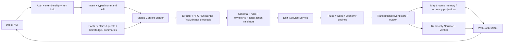

# Аудит готовности «Сказания» как замены ведущего и виртуального стола

Дата аудита: 13 июля 2026 года.

## Итог

«Сказание» — уже не пустой макет. Это сильный вертикальный MVP: есть красивый игровой интерфейс, аккаунты, кампании и комнаты, карта, листы героев, CRUD-инвентарь, серверные броски, частичный Rules Engine, event store с replay, Rule Retriever и несколько раздельных ролей ИИ.

Однако проект пока нельзя честно называть полной заменой ведущего и игрового стола. На момент первичного среза главная причина была не в отсутствии ещё одного экрана, а в разделённой архитектуре:

- наиболее выразительный свободный рассказчик и многие world tools живут в `legacy/shadow`-пути, где LLM и браузер всё ещё влияют на состояние; подтверждённый переход группы между сценами уже имеет отдельный событийный путь в `enforce`;
- детерминированный `enforce`-путь безопаснее, но пока покрывает лишь узкие вертикальные срезы — базовый тактический бой, ручную сборку встречи из mini-compendium, переход сцены с базовой лавкой и merchant/economy — и не умеет управлять сложными NPC и долгосрочной памятью мира;
- видимый бой на карте выполнялся отдельным браузерным движком, а не серверным Rules Engine.

После аудита базовый видимый бой и подтверждённая смена сцены в `enforce` переведены на серверные команды и события; подробный статус приведён ниже. Разделение всё ещё существует в `legacy/shadow`, а многие подсистемы отсутствуют. Поэтому текущая точная формулировка продукта: **играбельный демонстрационный MVP кооперативной RPG с частично авторитетным серверным ядром**, но ещё не автономный D&D-compatible VTT/GM.

## Что проверено

- `pnpm verify` объединяет актуальный test suite, TypeScript-проверку и production build;
- `pnpm test:coverage` измеряет покрытие server/domain кода; точные проценты следует брать из последнего запуска, а не фиксировать в аудите;
- браузерный путь: первоначальная настройка, повторный вход, загрузка комнаты, движение на карте, переход подземелье → город и город → город, majority vote, автоматическая лавка, server quote/покупка, reload/persistence журнала и сцены, лист героя, инвентарь и управление миром;
- локальная тестовая копия запускалась в отдельном временном storage и без ключа RouterAI;
- официальный ориентир правил: SRD 5.2.1, опубликованный по CC-BY-4.0;
- dependency audit: известных production-уязвимостей в установленном lockfile не найдено.

Существенное ограничение проверки: рабочее дерево не имеет ни одного Git commit, поэтому нет зафиксированного baseline/tag для надёжного сравнения и rollback.

## Реализовано после аудита / статус этапа 2

После первичного среза реализована **часть**, но не весь критерий этапа 2:

- в `enforce` обычный игрок может отправить только `StartCombat`, `MoveActor`, `MakeAttack` и `EndTurn` от имени назначенного ему героя; расширенные структурированные команды остаются административным контуром;
- сервер сам выводит живых участников инициативы, профиль атаки, AC цели, формулу/тип урона и дальность из сохранённых сущностей; подставленные клиентом `participants`, модификаторы, AC, damage expression, advantage/disadvantage и сходные overrides не являются источником истины;
- `players`, дополнительные `actors` и `enemies` входят в общий actor lookup. Reducer обновляет HP/`alive`, позиции, action economy, `activePlayerId` и `tacticalTurn` для героев и противников;
- ортогональное перемещение проверяет карту, стены, занятые клетки, существование пути, скорость и уже потраченное в ходу перемещение. Атака проверяет очередь хода и дальность;
- ограниченный детерминированный NPC scheduler выбирает ближайшего достижимого героя, при необходимости двигается и атакует, пропускает побеждённых участников, выполняет серверные ходы до следующего живого PC и автоматически завершает бой при поражении стороны. Он не вызывает LLM на каждого противника;
- UI в `enforce` отправляет эти команды без оптимистической механической мутации, показывает инициативу, раунд, текущего участника и остаток action/movement; `legacy/shadow` по-прежнему используют прежний browser path с `Math.random`;
- `state`, `battleLog` и `mapFeedback` формируются событиями, сохраняются в FileEventStore, проецируются в room и восстанавливаются replay. Real-HTTP тест проходит обычного игрока, вражеский ход, идемпотентный повтор и перезапуск процесса;
- сервер составляет тактическую реплику только из committed events, сохраняет её без дублей по idempotency key, а UI показывает структурированный `battleLog` отдельной «Боевой хроникой»; дальняя цель в интерфейсе блокируется до допустимой дистанции;
- для non-admin compatibility `PUT` в `enforce` сервер восстанавливает из event store `enemies`, `mechanics`, механические поля игроков, tactical turn, battle log/map feedback и клетки карты, принимая у игрока только ограниченные presentation-поля листа. Сам broad narrative state replacement, более широкие права admin и неатомарность event→room projection всё ещё не устранены.
- администратор в `enforce` может через UI/API выбрать bounded сложность и тему; EncounterAssembler считает официальный XP Budget per Character SRD 5.2.1 для уровней 1–20 и выбирает roster из пяти server-owned профилей Goblin Minion, Goblin Warrior, Skeleton, Zombie и Wolf;
- статблоки, HP, КД, атаки, XP, participants и координаты не принимаются от клиента/агента. Spawn разрешён только на раскрытых проходимых клетках, достижимых от группы, без feature/occupancy и минимум в 10 футах от каждого героя;
- `EncounterCreated` и `CombatStarted` входят в один commit; initiative ограничена героями и enemy IDs новой встречи, reducer/replay восстанавливает encounter/combat state, scheduler продолжает ходы NPC, а player projection удаляет внутренний source/provenance.

Это не завершённый боевой движок D&D. Mini-compendium состоит из пяти проекций только на поддерживаемый основной удар; в нём нет traits, saves/skills, resistances/immunities, multiattack, spells, reactions и особых действий. Также отсутствуют loot/rewards, диагональное движение, difficult terrain, cover/LOS, полноценные оружие и заклинания, эффекты всех conditions, concentration/death-save lifecycle, Tactical Controller agent, автоматический запуск EncounterAssembler Директором и realtime multi-browser синхронизация.

## Реализовано после аудита / merchant economy slice

- в текущей локации доступен отдельный экран торговца с карточкой NPC, кошельком героя, кассой NPC, вкладками покупки/продажи, количеством, stock, расшифровкой цены и явным итогом `цена за единицу × количество` до подтверждения команды;
- серверный каталог фиксирует базовые SRD 5.2.1 цены и provenance; известный `catalog_id` перекрывает присланный или сохранённый snapshot price;
- `AppraiseItem` принимает только `item_id` и создаёт `MerchantItemAppraised`: bounded server policy выводит цену нестандартного предмета из категории/редкости/состояния, сохраняет fingerprinted аттестацию в mechanics registry и игнорирует поддельные price/policy/appraisal fields;
- политика торговца и агентская поправка хранятся в basis points и ограничены кодом. Одна попытка торга использует серверный d20 и сохранённую Харизму героя; браузер не передаёт результат;
- `BargainWithMerchant`, `AppraiseItem`, `BuyItem` и `SellItem` проверяют campaign ACL, владение героем, `enforce`, локацию, доступность NPC, отсутствие активного боя, версию котировки, деньги обеих сторон, stock, количество и sellability;
- покупка/продажа одним event меняет валюту героя, `merchant.purse_cp`, инвентарь и склад; недостаток кассы ограничивает `max_quantity` и отклоняет выкуп до любых изменений. Idempotency, semantic command fingerprint, optimistic conflict и replay используют тот же FileEventStore, а `economyLog` сохраняет bounded контекст для UI и будущих агентов;
- клиент не делает optimistic mutation и при `409` требует заново получить котировку;
- Rule Pack расширен до 21 записи двумя economy rules; обязательная CC-BY-4.0 атрибуция и hash проверенного SRD PDF зафиксированы.
- resolved групповое решение в `enforce` теперь проходит server-owned цепочку Director → Scene Architect → `AdvanceScene`; `SceneAdvanced` сохраняет новую карту, adventure history и позиции отряда, очищая прежний encounter;
- bounded `scene_commerce` распознаёт поселение и вызывает `ShopAssembler`; `SceneAdvanced` и optional `MerchantCreated` входят в один commit с общим semantic fingerprint. Wilderness не получает постоянную лавку по умолчанию;
- клиент не может прислать `AdvanceScene` через generic command API или подделать Director capability; одно resolved party decision исполняется exactly once при конкурентных ключах, победивший retry не вызывает картографа повторно, а повтор idempotency key с другим переходом получает конфликт;
- при возврате в ту же нормализованную строку локации существующий торговец и его stock повторно используются.

Это ещё не полная городская экономика. Event-sourced `CreateMerchant`, `ConfigureMerchant`, `RestockMerchant`, `MoveMerchant`, `SetMerchantAvailability`, `AppraiseItem`, ограниченная касса и детерминированный `ShopAssembler` работают; мастер может запустить сборку вручную, а Директор автоматически включает её в подтверждённый переход к распознанному поселению. Однако party vote/resolution ещё хранится в compatibility-room, повторный вход определяется строкой локации без устойчивого `location_id`, а reputation, services, устойчивый диалог, theft, supply/demand и автоматические restock/economy clocks отсутствуют. Appraisal пока является ценовой формулой, а не идентификацией magic item или проверкой состояния. Полный контракт и граница доверия описаны в `docs/economy-contract.md`.

Важно для cutover: переключение кампании из `shadow` в `enforce` делает дальнейшие торговые операции авторитетными, но не доказывает происхождение уже импортированных денег, инвентаря, stock и policy. До миграции эти поля могли изменяться legacy-клиентом, LLM-tools или административным broad write. Production-cutover требует отдельной сверки начального economy snapshot; event replay гарантирует воспроизводимость только после принятой точки доверия.

## Матрица возможностей на момент первичного среза

Матрица и исходные блокеры ниже сохранены как состояние, обнаруженное аудитом. Для актуальных server-authoritative combat, scene-transition и merchant slices применяются поправки из предыдущих разделов.

| Возможность | Статус | Фактическое состояние |
|---|---|---|
| Аккаунты и сессии | Частично готово | Регистрация, scrypt-хеши, HttpOnly cookie и администратор работают. Нет полноценной membership/role модели кампании. |
| Комнаты и кампании | Частично готово | Есть persisted room, список кампаний и мастер нового мира. Нет lobby/join-by-code/ready/spectator flow. |
| Совместная синхронизация | Прототип | Polling раз в 1.5 секунды и broad state `PUT`; нет realtime presence, rebase/retry и устойчивого разрешения конфликтов. |
| Тактическая карта | Частично готово | Клетки, фишки, перемещение, zoom и базовый fog есть. EncounterAssembler валидирует revealed/reachable/occupied spawn и дистанцию 10 футов, но нет LOS, cover, per-player vision, измерителя, ping/drawings и общих spawn templates. |
| Лист персонажа | Частично готово | Базовые характеристики, HP, AC, скорость, история, импорт/экспорт. Нет полной модели saves/skills/spells/features/resources/death/concentration. |
| Инвентарь | Частично готово | CRUD сохранён; merchant slice умеет атомарно покупать/продавать и stack/remove предметы. Нет общего use/transfer/attunement/weight/equip-effects, полной схемы обязательных item-полей и полного item corpus. |
| Общий журнал | Частично готово | Сообщения, тактические записи и реплика автоматического перехода сохраняются с устойчивым message ID. Это всё ещё не структурированная память канона мира. |
| Серверные кубики | Частично готово | Dice Service и Roll Registry существуют. Часть браузерного боя всё ещё использует `Math.random`, registry недолговечен. |
| Rules Engine | Частичный P0 | Checks, saves, атака, урон, HP, ресурсы, initiative markers и replay реализованы. Полная семантика боя отсутствует. |
| Соответствие D&D/SRD | Начальный корпус | 21 краткое правило, небольшой equipment-price catalog и пять monster primary-attack projections против полного официального SRD; нет corpus классов, заклинаний, полного monster stat block и способностей. |
| Рассказчик | Частично готово | Legacy умеет импровизировать и использовать world tools; enforce рассказывает только по committed events, но получает слишком бедный контекст. |
| Набор агентов | Архитектурный прототип | Роли и prompts есть, но часть не подключена, а единого scheduler/supervisor lifecycle нет. |
| Создание боя агентом | Частично готово для admin | EncounterAssembler создаёт исполнимых combat actors и сразу запускает бой из admin UI/API. Автоматический Director/agent trigger пока не подключён, а произвольный `spawn_entity` по-прежнему не является combat actor. |
| Ходы NPC/врагов | Не готово на сервере | На момент среза упрощённый AI находился в браузере и ходил пакетом после игрока, вне единой initiative. После аудита добавлен ограниченный серверный scheduler; см. актуальный статус выше. |
| Память мира | Не готово | Event store надёжен как operational log, но нет facts/entities/relationships/quests/knowledge retrieval. |
| NPC и диалоги | Не готово | `npc_controller` не подключён; устойчивых NPC, целей, памяти, голоса и knowledge scope нет. |
| Города, магазины, торг | Частичный vertical slice | Есть persistent merchant schema, event-sourced lifecycle, bounded ShopAssembler, автоматическая связка Director → `SceneAdvanced` → optional `MerchantCreated`, stock/manual restock, server catalog/quotes, buy/sell/bargain/appraise, bounded merchant purse, atomic currency/item transfer и меню. Party vote ещё compatibility-room, identity локации основана на строке; нет services, устойчивого диалога, reputation и economy simulation/restock clocks. Appraisal не идентифицирует магию, каталог содержит лишь небольшой allowlist, EP не моделируется, а Persuasion proficiency/expertise не выводятся из полной модели персонажа. |
| Production deployment | Частично готово | Docker/healthcheck/tunnel есть. Нет DB-backed multiwriter, restore rehearsal, observability, durable quotas и production E2E. |

## Исходные блокеры P0

Формулировки в этом разделе фиксируют причины вывода на момент аудита. Часть пунктов 1–3 и 6 закрыта только для узкого боевого пути `enforce`, но сохраняется в `legacy/shadow` либо за пределами реализованного среза.

### 1. Не было единого источника истины

На момент среза три механических контура могли давать разные результаты:

1. `src/tactical-engine.ts` меняет карту/HP и бросает через браузерный `Math.random`;
2. legacy RouterAI tools возвращают effects, которые клиент применяет к комнате;
3. `server/rules-engine.mjs` создаёт события в `enforce`.

После аудита start/move/attack/end-turn в `enforce` сведены к server-authoritative command/event flow. Риск всё ещё существует в `legacy/shadow`, для широких compatibility writes и механик вне этого боевого среза.

### 2. Игроки и враги были представлены разными несовместимыми схемами

На момент аудита UI хранил врагов в `state.enemies`, тогда как `listActors()` Rules Engine, Intent Parser и Adjudicator использовали `players + actors`. Из-за этого реальный enemy из комнаты не являлся валидной целью authoritative атаки или инициативы. После аудита `enemies` включены в actor lookup и reducer, а EncounterAssembler добавил пять server-owned projections с `stat_block_id`; единая полная persisted schema для персонажей, существ, действий и эффектов всё ещё не реализована.

Нужна единая сущность:

```text
Actor {
  id
  kind: pc | monster | npc
  controller: player | npc | system
  stat_block_id
  token_id
  resources
  conditions
}
```

### 3. Боевой цикл не являлся D&D-циклом

На момент аудита видимая атака героя была только melee STR + proficiency + фиксированный d8. Не было выбора оружия, finesse/ranged, advantage, critical path, range, cover, spells, bonus action, reaction, opportunity attack и полноценного condition/death flow. Все враги двигались и атаковали одним браузерным пакетом после каждого героя, а серверный `EndTurn` лишь переставлял индекс и не запускал NPC.

После аудита `enforce`-команды получают trusted attack profile и server path/range/turn checks, а `EndTurn` запускает bounded NPC scheduler. Однако оружие/заклинания, cover/LOS, difficult terrain, диагонали, reactions и полный condition/death flow по-прежнему отсутствуют; `legacy/shadow` browser path не удалён.

### 4. Исполнимая встреча появилась, но ещё не управляется автономным агентом

На момент аудита `spawn_entity` содержал только координаты, тип и label, поэтому не гарантировал появление управляемой боевой фишки. После аудита admin-only EncounterAssembler создаёт `stat_block_id`, HP, AC, initiative modifier, один primary attack, официальный XP budget, безопасное размещение и атомарный старт боя. Блокер закрыт для ручного bounded admin flow, но не для автономного агента: Director integration, tactics profile, полный набор действий, loot и rewards отсутствуют.

### 5. Модель всё ещё может влиять на механику в default flow

Новые кампании стартуют в `shadow`, а default resolver допускает legacy. В этих режимах LLM выбирает DC/world tools, клиент применяет effects и сохраняет broad room state. При переходе в `enforce` существующий snapshot импортируется как исходное состояние: это техническая точка cutover, а не доказательство того, что прежние деньги, предметы, торговцы и их цены были получены авторитетно. Целевой invariant должен быть жёстким:

> LLM предлагает typed intent/command, но никогда не бросает кубики и не меняет HP, карту, предметы или деньги. Изменение делает только валидатор + доменный движок + atomic commit.

### 6. Rule provenance и derived stats не были авторитетны

На момент аудита Rules Engine принимал клиентские/планировочные `attack_modifier`, `damage_expression` и даже override AC. После аудита player combat path санитизирует эти поля и выводит профиль/AC/урон/range на сервере. Полноценные derived stats из versioned character/item/spell/stat-block entities и общий referential-integrity gate для всех административных/orchestrated commands всё ещё нужны.

### 7. Нет настоящей памяти мира

Сохраняются room JSON, события, snapshots и traces, но в prompts попадают в основном текущая сцена и последние сообщения. `campaignConcept` и content boundaries после пролога почти не используются. Нет:

- канонических фактов с provenance;
- локаций, NPC, фракций и отношений как сущностей;
- квестов, незавершённых нитей и clocks;
- отличия истины от слухов/убеждений NPC;
- списка знаний каждого персонажа;
- episodic summaries с ссылками на исходные events;
- retrieval по campaign + visibility + time.

### 8. NPC/social/economy domain остаётся неполным

Prompt `npc_controller` не подключён. Social intent в enforce превращается в ruling, а не устойчивый диалог с NPC. После аудита магазины получили server-owned stock/quote, appraisal registry, bounded purse, bargain, purchase/sale, currency/item transfer и авторитетные lifecycle-команды создания, настройки, restock, перемещения и доступности. `ShopAssembler` формирует безопасный proposal со стартовой кассой и автоматически вызывается Директором для подтверждённого перехода в распознанное поселение. Нет услуг, устойчивого диалога, расписания/автоматических restock clocks, supply/demand и долгосрочных NPC relationships; appraisal пока использует упрощённую server formula, party vote ещё не event-sourced, а локация не имеет устойчивого ID. В `legacy/shadow` валюта всё ещё остаётся редактируемым полем листа, а cutover принимает предварительно проверенный snapshot как начальную истину.

## Блокеры P1: multiplayer, надёжность и безопасность

- Whole-state `PUT` всё ещё создаёт lost updates для совместимых narrative/admin изменений; non-admin не может заменить event-store combat mechanics в `enforce`, но при `409` клиент не rebases и не повторяет операцию.
- Ошибки typed combat command показываются игроку; общая обработка ошибок room sync остаётся неполной.
- Один localStorage key и один BroadcastChannel не изолированы по пользователю/кампании.
- `online` — статический флаг персонажа, а не heartbeat/presence.
- Event commit, roll consume, narration, room projection и trace не образуют транзакцию/outbox workflow.
- Проекция не имеет строгого monotonic `state_version` gate и reconciliation worker.
- FileEventStore рассчитан на один процесс; sync filesystem I/O будет блокировать event loop при росте истории.
- Room, command и narrate responses для игрока проходят единую viewer projection: private adventure buckets, внутренние merchant-поля и feature нераскрытых клеток скрываются. Explanation/trace response пока не имеет столь же тонкой event-level projection и остаётся отдельным риском.
- Roll Registry, rate limits и AI quotas живут в памяти; нет campaign token/cost budget и kill switch.
- Есть HTTP restart/replay тест базового combat slice; нет crash-between-commit/projection, multiprocess/load, real-provider и automated multi-browser E2E.
- До этого аудита `storage/engine` и `storage/turn-traces` могли попадать в Git/Docker context; исключение всего `storage/` уже добавлено.

## Целевая архитектура



Практический следующий storage target — PostgreSQL с event/outbox/read-model tables. Для локального single-user режима допустим SQLite adapter, но production должен сохранять те же transactional contracts.

### Границы ролей

- **Worldkeeper** — только читает canonical facts и knowledge конкретного персонажа; отвечает с `fact_id/source_event_ids`.
- **Director** — предлагает scene beats, quests и encounter requests; не имеет HP/item/currency tools.
- **Scene Architect** — выдаёт semantic scene graph и constraints; детерминированный Map Compiler проверяет connectivity, входы, выходы, LOS и spawn zones.
- **Encounter Builder** — выбирает только licensed compendium IDs, считает threat budget и размещение; не сочиняет числовой stat block.
- **NPC Controller** — выбирает социальное намерение из целей/убеждений NPC.
- **Tactical Controller** — выбирает только ID из списка legal actions, подготовленного Rules Engine.
- **Adjudicator** — переводит intent в typed commands; низкая уверенность ведёт к clarification/owner-approved ruling.
- **Economy/Shopkeeper** — LLM отвечает за реплику и характер; Economy Engine — за цену, stock, деньги и предметы.
- **Narrator/Verifier** — работают только после commit и ничего не меняют.

## Поэтапный план

### Этап 0. Baseline и защита данных — начат этим аудитом

- исключить весь runtime `storage/` из Git и Docker context — выполнено;
- исправить динамические размеры карты, испорченные UI-строки и базовую доступность модалей — выполнено;
- привести документацию Rule Pack к фактическим 19 правилам — выполнено;
- создать первый baseline commit/tag и внешний backup — требует решения владельца;
- добавить browser characterisation tests текущего happy path.

Критерий завершения: чистый воспроизводимый build, backup, tag и отсутствие секретов/кампаний в distributable artifact.

### Этап 1. Единая авторитетность и multiplayer

- единый `actors` schema;
- command-only writes для механики и controlled character/economy updates;
- explicit campaign membership/roles;
- transactional event + outbox + projections;
- durable idempotency/roll registry;
- WebSocket/SSE, scoped client cache, presence/reconnect;
- visibility projection для room, events, traces и agent context.

Критерий завершения: два игрока одновременно меняют разные разрешённые части состояния без lost update; restart/replay возвращает ровно то же состояние.

### Этап 2. Server-authoritative combat vertical slice — частично реализован после аудита

- server-owned SRD 5.2.1 monster/stat-block mini-compendium — реализовано для пяти primary-attack projections;
- `CreateEncounter/StartCombat/Move/Attack/EndTurn/EndEncounter` — реализовано в bounded admin/player контурах; произвольный `SpawnActor` не открыт;
- server map/path/range/occupancy validation;
- initiative ribbon, rounds, action/movement/bonus/reaction resources;
- NPC scheduler и Tactical Controller поверх legal actions;
- damage/critical/defenses/conditions/concentration/death saves;
- automatic encounter end и loot.

Критерий завершения: 4 PC + 3 NPC проходят бой от spawn до loot; restart в середине даёт идентичный replay; каждый бросок и HP change имеет event/rule provenance.

Текущий результат закрывает server command boundary, базовые map/turn checks, initiative UI, admin-created encounter, пять server-owned SRD-проекций, safe spawn, atomic `EncounterCreated + CombatStarted`, автоматические ходы NPC и restart/idempotency replay flow. Критерий этапа ещё не достигнут: нет 4 PC + 3 NPC multi-client flow, полного stat block/action набора, полного набора боевых правил, Tactical Controller и loot/rewards.

### Этап 3. Полный персонаж, предметы и заклинания

- normalized character sheet, derived stats, skills/saves/proficiencies;
- spell catalog, slots, preparation, components, range/area, saves/attacks, concentration;
- class resources/rest recovery/level-up;
- weapon/armor/item profiles, equip/use/consume/transfer/weight/attunement;
- безопасный importer с versioned mapping.

Критерий завершения: характеристики нельзя подделать whole-state PUT; атаки и заклинания полностью вычисляются из server entities.

### Этап 4. Память мира и настоящий Worldkeeper

- canonical facts, entities, relationships, quests, threads и clocks;
- truth отдельно от NPC beliefs/rumors;
- per-character `KnowledgeRevealed` ledger;
- scene/session summaries с source event IDs;
- semantic retrieval только после campaign/visibility/time filter;
- `campaignConcept`, tone и boundaries в каждом agent context.

Критерий завершения: факт, обещание NPC и незавершённый квест корректно вспоминаются через несколько сессий, а private knowledge не утекает.

### Этап 5. NPC, социальные сцены, города и экономика — начат

- persistent NPC profile: goals, beliefs, relationships, voice, schedule, inventory;
- conversation/social events и последствия;
- shops со stock/base price/restock/services;
- event-sourced `CreateMerchant`, `ConfigureMerchant`, `MoveMerchant`, `RestockMerchant`, `SetMerchantAvailability` и `AppraiseItem` вместо snapshot mutations — готово для merchant slice;
- verified bargain check → bounded price modifier;
- atomic purchase/sale/currency/item/merchant-purse transfer;
- reputation, theft и economy clocks.

Критерий завершения: разговор → торг → серверный бросок → покупка → согласованное обновление stock, денег и инвентаря после reconnect.

Текущий slice закрывает подтверждённое решение группы → `SceneAdvanced` + bounded ShopAssembler proposal → event-sourced создание/manual restock/перемещение → server quote → оценку/торг → покупку/продажу с ограниченной кассой → replay. Остальные пункты этапа, особенно event-sourced party vote, устойчивый разговор, `location_id`, services, reputation/supply-demand и автоматические restock/economy clocks, не готовы. Каталог цен остаётся частичным, appraisal не идентифицирует magic properties, electrum отсутствует, а бонус Persuasion пока не вычисляется из полной модели proficiency/expertise персонажа.

### Этап 6. Автономная режиссура и генерация сцен

- Director создаёт запрос, а не state mutation — готово для подтверждённого перехода сцены в `enforce`;
- Architect компилирует валидную карту;
- ShopAssembler наполняет распознанное поселение до narration; EncounterAssembler доступен мастеру вручную, но ещё не подключён к автоматическому Director/scene flow, отдельного NPC social assembler нет;
- переход сохраняет unresolved quests и не закрывает цель без подтверждённого результата;
- campaign pacing, downtime, travel, random encounters и rewards.

### Этап 7. Расширение SRD и production hardening

- полный разрешённый SRD corpus: classes, spells, monsters, equipment, feats и glossary;
- механическая coverage matrix и referential integrity CI gate;
- корректная CC-BY-4.0 attribution и подтверждённые права на assets;
- удаление legacy/shadow после canary/rollback window;
- backups/restore, reconciliation/chaos/load/security/real-provider E2E;
- durable quotas, cost observability, circuit breakers, retention/encryption.

Только после прохождения этих gates продукт следует рекламировать как полную замену ведущего/стола для поддержанного ruleset.

## Следующий конкретный инкремент после server-authoritative slice

Первоначальная рекомендация аудита — перенести move/attack/turn/NPC loop на сервер — выполнена как частичный вертикальный срез. Базовая исполнимая встреча теперь собирается сервером; следующий инкремент должен расширить её до содержательно полного боевого цикла:

1. расширить versioned mini-compendium полными разрешёнными monster/weapon profiles: traits, saves, resistances, multiattack, spells и особые действия;
2. добавить encounter outcome, rewards/loot и безопасные расширяемые spawn templates;
3. подключить bounded encounter request к Director/scene flow без передачи числовой механики агенту;
4. расширить геометрию диагоналями, difficult terrain, range bands, cover и LOS;
5. добавить spells, bonus action/reaction, opportunity attacks, конкретные conditions, concentration и death saves;
6. отделить Tactical Controller, который выбирает только из server-generated legal actions;
7. закрыть полный бой real HTTP + два браузера + reconnect/restart и затем перейти с polling к realtime stream.

Это доведёт уже созданную авторитетную границу до воспроизводимой встречи, но всё ещё не закроет память мира и социальные сцены; экономика пока покрыта только merchant vertical slice.

## Правила и лицензирование

SRD 5.2.1 является подходящим текущим открытым ориентиром и опубликован Wizards of the Coast по CC-BY-4.0. Он существенно шире локального pack из 21 записи. До расширения compendium необходимо:

- поддерживать зафиксированные source/version/hash для каждого расширения;
- сохранять требуемый attribution statement в release artifact;
- не смешивать locked campaigns разных редакций без явной миграции;
- не копировать материалы вне SRD только потому, что они существуют в D&D Beyond/books;
- использовать собственный мир либо отдельно лицензированный setting content;
- позиционировать продукт как совместимый, а не официальный/одобренный.

Официальные источники:

- <https://www.dndbeyond.com/srd>
- <https://media.dndbeyond.com/compendium-images/srd/5.2/SRD_CC_v5.2.1.pdf>
