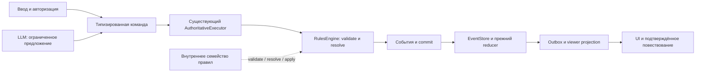

# Варианты развития и порядок небольших PR

Порядок уточнён результатами следующих проходов в
[текущем списке приоритетов](10-current-priorities.md). Этот документ сохраняет
исходные номера R01–R16 и подробности вариантов; они не являются новыми ID багов.

Это предложения по результатам аудита `c7efdca`, а не новый согласованный
roadmap. Реализация не входит в этот PR. Подробные основания и ограничения
доказательств находятся в тематических отчётах; здесь описан выбор между
вариантами и критерии завершения.

## Рекомендуемое направление

Сохранить модульный монолит: `.mjs` на сервере, React/TypeScript на клиенте,
один серверный движок, события и файловое хранилище. Главная отдача сейчас —
закрыть разрывы уже существующих контрактов, затем упростить добавление одной
команды, семейства эффектов или типа сцены. Новый framework не устраняет
непривязанный бросок, обход учёта токенов или дублирующую сериализацию.

| Вариант | Что меняется | Выгода | Цена и предел | Решение |
| --- | --- | --- | --- | --- |
| A. Укрепить существующие модули | Привязка бросков, полный opt-in typecheck, общий image generator, учёт lore, проверки пакетов | Небольшие проверяемые изменения, меньше скрытых обходных путей | Монолит остаётся большим | Начать здесь |
| B. Делить по доменным обязанностям | Семейство команд со своим validate/resolve/apply за прежним фасадом RulesEngine; маршруты с внедряемыми зависимостями | Новая механика требует меньше разрозненных правок | Нужно сохранить порядок событий и post-event последствий | Делать вместе с очередной реальной механикой |
| C. Данные для повторяющихся семейств | Общие поля дальности, цели, ресурса, поддержки и resolver ID у нескольких уже работающих действий | Каталог и UI меньше дублируют серверные факты | Универсальная схема быстро обрастает исключениями | Только после сравнения 2–3 действительно похожих реализаций |
| D. Новый storage/distributed runtime | Другой adapter и межпроцессная координация | Несколько writers, иные эксплуатационные гарантии | Миграция, recovery, backup, нагрузка и новый класс отказов | Отложить до конкретной потребности; сначала профиль текущего пути |

Заимствования из [внешних проектов](01-comparable-projects.md) поддерживают
варианты B/C: небольшой interface, локальное владение поведением и явная
регистрация типов. Они не требуют копировать чужую платформу, систему
наследования или plugin marketplace. Активный ruleset должен оставаться
закреплённым за кампанией, а не подменяться новым пакетом при очередном запуске.

## Первая очередь: исправимые разрывы контрактов

Каждая строка — отдельный PR; их не следует объединять в один большой
«рефакторинг архитектуры».

| Шаг | Результат | Основание | Размер | Критерий завершения |
| --- | --- | --- | --- | --- |
| R01 | Механический бросок всегда связан с объявленной проверкой | SEC-01 | S/M | Generic/чужой/устаревший roll отклонён до изменения мира; штатная карточка и same-key retry работают |
| R02 | Пролог, хроника и изображения имеют понятный учёт расхода | AI-02, Standards | S/M | Lore проходит имеющийся `MeteredLLMClient`; item image использует общий проверяющий генератор; fake provider подтверждает quota/usage и отказ плохого файла |
| R03 | Все этажи выбранной библиотечной карты структурно допустимы | AI-06 | S/M | Повреждённый верхний этаж не выбирается; валидный многоэтажный дом, лестницы, переход и replay сохраняются |
| R04 | `@ts-check` действительно подключает файл к проверке | QA-02 | S | Каждый opt-in-файл входит в программу TypeScript; типовая ошибка в ранее пропущенном файле обнаруживается |
| R05 | Пакет с битой ссылкой или конфликтующим ID не активируется молча | ARC-05/06 | S | Неизвестный `entity_ref` и конфликт `(ruleset_id, rule_id)` дают понятную ошибку; оба существующих ruleset проходят |
| R06 | Медленный SSE-клиент не создаёт бесконечную очередь | SEC-06 | S/M | Ограничены байты/время очереди; reconnect получает полную разрешённую карту, baseline hash не продвигается за отброшенными данными |

R01 и R02 касаются конкретно воспроизведённых/прослеженных путей. R03 доказан
искусственной порчей верхнего этажа: это не утверждение, что текущая библиотека
пользователя уже содержит такую карту. R04/R05 — защита разработки и
расширения. Номера не заменяют оценку продуктовой срочности владельцем.

Небольшой параллельный PR — актуализация канонических документов по
[Spec-аудиту](07-product-and-spec.md). В нём следует удалить противоречащие
текущему коду утверждения, а историческим планам оставить дату и статус.
Недостаточно дописать очередное исправление в конец многотысячного файла:
старое утверждение продолжит направлять разработчиков неверно.

## Вторая очередь: восстановление и наблюдаемость

| Шаг | Изменение | Проверка и ограничение |
| --- | --- | --- |
| R07 | Уточнить границу ack проекции и recovery trace (SEC-02/03) | Инъекция сбоя/дрейфа при той же версии; повтор ключа восстанавливает минимальное объяснение без нового игрового события. Сначала проверить, какие гарантии уже даёт reconcile |
| R08 | Сохранить исходный request и ключ при неопределённом исходе броска (SEC-04) | Ошибка после consume и до commit; retry с тем же ключом. Общая транзакция registry+event store — отдельная более дорогая альтернатива |
| R09 | Сделать source metadata, unknown ruleset/event policy явными (ARC-01…04) | Отдельно current command и legacy replay; неизвестная текущая редакция не становится SRD по умолчанию. Низкоуровневый probe не следует выдавать за доступную HTTP-атаку |
| R10 | Укрепить test-server fixture и сетевую изоляцию (QA-04/05) | Временные данные, явный пустой ключ, localhost stub, ограниченный стресс старт/стоп; рекурсивный writer guard (Standards) |
| R11 | Разделить результаты тестов, eval и release readiness (AI-01, QA-01/08) | Реально исполняемые scenario IDs и missing IDs; commit/dataset/prompt hashes; live-оценки только отдельным явно затратным запуском |

Протокол durable write и maintenance lock из SEC-05/07 нужно выбирать после
фиксации эксплуатационного контракта: обычный restart, аварийное завершение
процесса и потеря питания — разные сценарии. Отсутствие fsync каталога не
означает доказанную потерю данных при каждом restart. Slim runtime image также
не обязан содержать все инструменты: допустим отдельный проверенный runbook
обслуживания с host checkout или maintenance target (QA-07).

## Третья очередь: оптимизировать то, что измерено

Свежий [benchmark](08-evidence-and-method.md#повторный-benchmark-большой-кампании)
показал p95 HTTP MoveActor **7,33 с** на расширенной фикстуре против **0,111 с**
на маленькой. Ответ большой кампании — около **6,17 МБ**, при выключенных LLM и
SSE. Это достаточное основание заниматься полным HTTP-путём, но недостаточное
основание сразу менять FileEventStore или вводить глобальный cache.

1. **R12: профиль стадий.** На том же наборе измерить load, command resolve,
   reducer/normalization, commit, room projection, viewer projection,
   JSON serialization, размер ответа и event-loop delay. Отдельно добавить
   1/2/5 SSE-подписчиков с разными правами и browser parse/render. Не запускать
   нагрузочный benchmark одновременно с полным suite.
2. **R13: сократить передачу, сохранив знание мира.** Рассмотреть компактный
   ответ команды плюс versioned read model, отдельную выдачу длинных журналов
   и viewer-specific страниц памяти. Сравнить с текущим полным snapshot по
   простоте reconnect, числу запросов и CPU. Карта уже умеет full/delta/unchanged;
   сначала выяснить, что ещё занимает мегабайты. Canonical memory не обрезать.
3. **R14: уменьшить повторные преобразования.** Если профиль подтвердит вклад,
   выделить внутренний нормализованный reducer-путь (ARC-07) либо request-local
   projection/retrieval cache (AI-08). Ключ включает версию, viewer и время,
   если политика зависит от времени. Проверки равенства обязательны на каждом
   промежуточном событии, не только на конечном HP.
4. **R15: клиентский профиль.** Отдельно измерить UI-02…06: healthy SSE и polling,
   прицеливание, `boardCells`, перебор props по тайлам и 3D-area preview.
   Начать с локальных индексов и вычисления неизменяемой части view model.
   Число React commits, p95 кадра, draw calls и память полезнее количества
   строк компонента. UI-07 снят как дефект: reset счётчиков уже существует.
5. **R16: initial load.** Основной JS 2,20 МБ и CSS 563 КБ до сжатия требуют
   проверки actual import graph, parse/evaluate и пути первого экрана.
   Сравнить выделение редко открываемых панелей/каталогов и локализацию CSS;
   не разбивать bundle только ради исчезновения предупреждения Vite.

Порог улучшения следует записать в спецификацию до правки и сравнивать на одном
окружении. Например, ранее поставленная цель «обычный ход большой кампании до
секунды» может быть отдельной задачей с бюджетом стадий; этот аудит её не
объявляет достигнутой. Локальный n=20 — baseline для эксперимента, не SLA.

## Как облегчить добавление механик

Практическая цель — новый тип действия не должен требовать знания всей
`rules-engine.mjs`, `index.mjs` и `useGameSession.ts` одновременно. Минимальная
последовательность расширения существующей архитектуры:

Это направление унификации, а не утверждение, что все пути baseline уже
проходят через Executor. Его оставшиеся прямые writers и атомарный гибрид
merchant clock перечислены в тематических отчётах.

Первым выделять небольшой домен с уже существующими тестами: его нормализацию,
проверку, вычисление событий и применение. Фасад движка и публичные экспорты
сохранить, обратных импортов из `server/rules/*` не добавлять. Правку поведения
отделять от переноса. Выделение файла, передающего сотню callback-ов обратно в
движок, не уменьшит сложность интерфейса.

Для трёх похожих работающих действий можно сравнить два варианта: явные
handlers с общими маленькими helper-функциями либо таблица описаний с общим
resolver. Выбирать второй только там, где различаются данные, а не порядок
эффектов и правила отказа. Новый event handler должен иметь явную классификацию
видимости и статус поддержки; отрицательные projection-тесты нужны до UI.

На клиенте прежний `useGameSession` может остаться фасадом. Выделение
request/retry и view-model функций должно сначала уменьшать число мест,
которые знают об idempotency и очереди снимков, сохраняя API экрана. Нужны
реальный HTTP-путь и ручная проверка двух игроков для каждой будущей UI-правки.

## Продукт после укрепления основы

Развивать законченные пользовательские цепочки из SPEC-01…06: обычная группа
сама начинает и заканчивает вечер; главная цель имеет причинное доказательство;
одно семейство свободных действий оставляет наблюдаемый след; один пакет правил
доведён от источника до честной карточки поддержки. Сложные NPC и опциональная
автономия героев должны использовать те же команды и требовать явного выбора
игрока там, где система действует за его героя.

Не начинать сейчас универсальный язык правил, произвольные серверные plugins,
новый LLM в горячем боевом ходе, полный перевод сервера на TypeScript,
microservices или миграцию базы только из-за размера файлов. Вернуться к этим
вариантам можно при конкретном ограничении, которое более узкие изменения
не решают.
