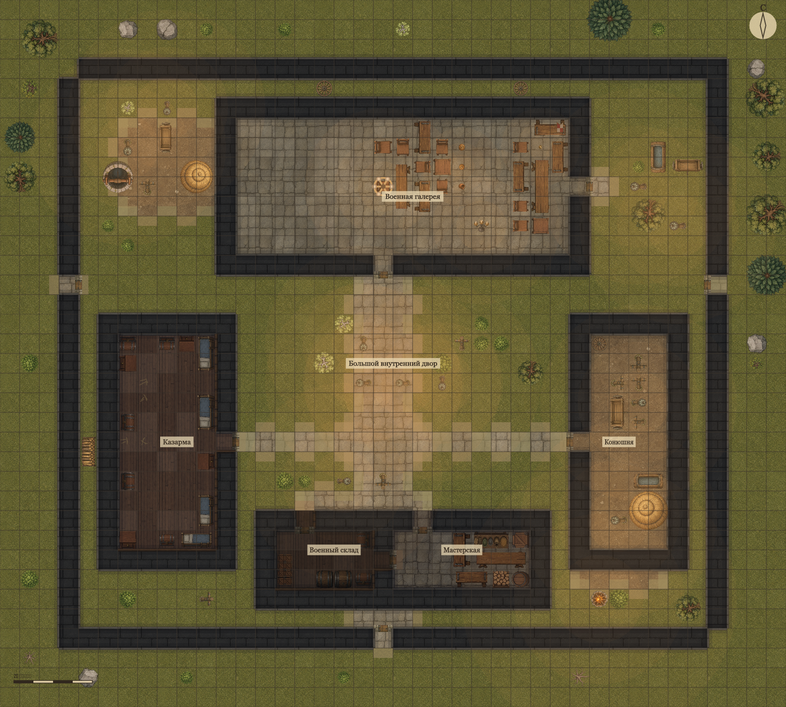

# Осмысленная генерация и крепость Ареса

## Эталон

Эталон — новая стартовая карта Асстоханских равнин, версия шаблона 2:
40×36 клеток по пять футов. Военная галерея, казарма, конюшня, склад и
мастерская связаны двором и дверями; три выхода ведут за внешнюю стену.
Партия начинает у стола в галерее, Арес закреплён за тем же столом.
Изображение выше получено из этой модели тем же рендерером, которым пользуется
игровая комната; для обзора показан весь план без фишек.

Использованы существующие собственные фактуры и атлас предметов проекта.
Изображение-референс пользователя не копировалось. Новых npm-зависимостей
и внешних ассетов нет.

## Общий конвейер

`generateSceneGeometry` выбирает существующий тематический генератор и
возвращает полную `TacticalMap` вместе с производными клетками. Создание
кампании и переходы сохраняют эту карту целиком: зоны, крупные footprints
мебели, окна, двери, идентификаторы объектов и точки появления.
Прежний клеточный интерфейс `generateSceneCells` остаётся совместимым
интерфейсом для старых инструментов.

Раньше результат генератора превращался в legacy-клетки и затем собирался
обратно. У кухни терялось назначение, длинные столы исчезали, а окна и
идентификаторы дверей заменялись приблизительной геометрией. Теперь клеточное
представление служит механике совместимости, сохраняя полную карту источником
данных. Повторный вход использует сохранённую карту, а не новый результат
генерации.

## Назначение помещений

План расстановки `placeProps` принимает `purpose` для каждой зоны. Этот
параметр принадлежит генерации; новый формат сохранений для него не нужен.

| Назначение | Обстановка |
| --- | --- |
| `gallery` / `hall` | столы, места вокруг них, свет; ограничено число столов и люстр |
| `barracks` | группы коек, тумбочек и сундуков |
| `kitchen` | очаг, шкафы, посуда и припасы |
| `store` | штабели ящиков и бочек |
| `stable` | сено, кормушка, привязи |
| `workshop` | рабочие столы, полки и материалы |
| `courtyard` | один колодец, ограниченное число телег и хозяйственные группы |
| `exterior` | растительность и камни |

Пороги и пути к дверям резервируются до расстановки. Количество повторяемых
предметов ограничено назначением помещения: увеличение плотности не создаёт
пять колодцев. Неизвестное назначение сохраняет обычную тематическую схему.
Этот механизм применён и к обычному генератору здания с участком.

## Связь с историей и игрой

- NPC могут иметь заданную зону поста и якорный предмет; фиксированная
  расстановка не переносит существующих персонажей при чтении сохранения.
- Рассказчик получает `spatial_context/v1`: текущее помещение, известные зоны
  и ближайшие видимые предметы. Скрытые зоны и бинарные слои карты в этот
  контекст не передаются.
- Погодный эффект определяется зоной позиции действующего героя. Двор и
  галерея одной карты могут давать разные условия; проекция игрока и бриф
  ведущего используют тот же расчёт.
- Камера учитывает размер карты, кампанию и этаж. Колесо увеличивает детали,
  перетаскивание перемещает полотно, двойной щелчок возвращает общий вид.

## Границы

Крепость является подготовленной композицией. Остальные карты используют свои
тематические генераторы и общий механизм семантического наполнения.
Срезанные углы представлены клетками; произвольные криволинейные коллизии
не добавлены. Набор мастерской изображает общее ремесленное помещение,
отдельных новых ассетов кузницы и животных нет.

Ранее сохранённые карты автоматически не заменяются: изменения дверей,
предметов и исследованной геометрии должны сохраняться. Для эталона нужно
создать новую кампанию Асстоханских равнин.

## Проверки

Проверяются связность, проходимость входов, непересечение предметов и порогов,
семантические ограничения, устойчивые старты, сохранение полного формата,
возврат к карте, видимость контекста и погода в разных зонах. Основные тесты:
`scene-map-fidelity`, `building-generator`, `prop-placement`,
`authored-scene-map-consistency`, `weather`, `tactical-ui`, `board-render`.
Дополнительно проверены 200 начальных значений генератора для крепости и
200 для обычного здания: обязательное наполнение склада, лестница и люстра
не пропали ни в одной из этих карт.

Ручная проверка 2026-09-06 в браузере, комната `ARES-REF-0906`:
два тестовых героя, движение от стола к двери, открытие двери и выход во двор,
переключение между героем во дворе и героем в галерее, перезагрузка страницы.
Маршруты проходят через проём; позиции и открытая дверь сохраняются;
индикатор погоды меняет эффект по выбранному герою. Проверены общий вид,
увеличение колесом и перемещение полотна. Это проверка двух героев одного
тестового ведущего; две независимые пользовательские сессии здесь не проверялись.
