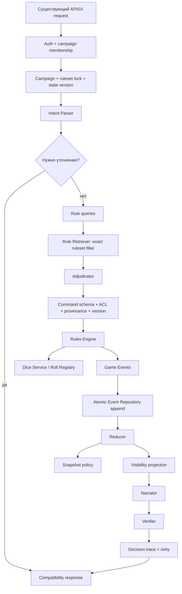

# Целевая архитектура

## Цели

Целевая система должна сохранять текущий UI и API на время миграции, но перенести механическую власть с LLM и browser state на проверяемые серверные команды, события и reducer.

Ключевые инварианты:

1. LLM интерпретирует и повествует, но не пишет HP, ресурсы, инвентарь или порядок боя.
2. Каждый механический результат имеет `rule_id`, `house_rule_id` или `ruling_id`.
3. Все случайные значения выдаёт Dice Service и связывает с `roll_id`.
4. Каждая кампания закреплена за конкретным ruleset и набором packs.
5. Состояние меняется только применением сохранённых событий.
6. Команда с повторным `idempotency_key` не создаёт события повторно.
7. Narrator получает только разрешённую visible projection.
8. Compatibility read-модель можно восстановить из event stream без потери авторитетного состояния.

Runtime уже переведён на enforce-only: Rule Pack/Retriever, durable Dice Service/Roll Registry, Rules Engine, FileEventStore с hash-verified projection outbox/checkpoint, Game Orchestrator, Narrator/Verifier и trace store работают без legacy/shadow веток. Этот документ описывает **конечные инварианты**. Сейчас остаются data cutover старых сохранений, single-writer файловое хранение, неполное покрытие правил и ограниченные production-like integration/soak tests.

## Целевой игровой цикл



## Ответственность компонентов

### API compatibility adapter

- Принимает текущие request shapes.
- Преобразует их в versioned command request.
- Возвращает текущему frontend знакомые narration/effects/state fields.
- Не выполняет механику и не пишет state самостоятельно.

### Game Orchestrator

- Загружает campaign metadata и snapshot.
- Разрешает engine mode.
- Передаёт только visible state в Intent Parser/LLM.
- Запускает retrieval строго для `campaign.ruleset_id` и `enabled_rule_packs`.
- Обеспечивает один idempotency scope на пользовательский ход.
- Append-ит события с expected stream/state version.
- Создаёт decision trace.

Orchestrator не должен содержать формулы конкретных правил: они принадлежат Rules Engine и Rule Pack.

### Intent Parser

Возвращает структуру намерения, список целей, недостающие данные и уверенность. Он не генерирует commands и не изменяет state. Rule-based parser может быть быстрым первым уровнем, LLM — ограниченным fallback после redaction hidden state.

### Rule Pack и Rule Repository

- Immutable/versioned corpus.
- Стабильные IDs, manifest, license/provenance, bilingual text и aliases.
- Referential-integrity check между rules, ontology, engine command mappings и house rules.
- Numeric translation integrity как обязательный ingestion gate.
- Активная кампания не меняет ruleset автоматически при обновлении файлов.

### Rule Retriever

Обязательный порядок:

```text
normalize query
→ aliases/glossary
→ exact ruleset_id + enabled packs filter
→ lexical/local-vector search
→ merge
→ bounded ontology expansion
→ deterministic rerank
```

Нельзя сначала искать по всем редакциям, а затем удалять чужие результаты: фильтр должен применяться до scoring и expansion.

### Adjudicator

- Выбирает применимые rules и предлагает typed commands.
- При низкой уверенности возвращает clarification или explicit ruling draft.
- Не выполняет roll и не применяет events.
- Не создаёт «каноническое правило» из ответа модели.

### Rules Engine

- Валидирует command allowlist, actor permissions, target visibility, provenance, ruleset и expected state version.
- Просит Dice Service о roll только после validation.
- Возвращает events; сам не пишет repository.
- Reducer применяет только известные versioned event types.
- Повторный replay одинакового event stream даёт одинаковое state.

### Dice Service и Roll Registry

- Парсит ограниченную грамматику dice expressions.
- Использует криптографический RNG в production и deterministic injected RNG в тестах.
- Привязывает roll к campaign, actor, purpose, visibility и expiry.
- Consume выполняется один раз; повтор с тем же idempotency key возвращает тот же результат, с другим — ошибку.
- Registry должен стать durable либо быть частью одной атомарной turn transaction. In-memory registry недостаточен для нескольких процессов и рестарта.

### Event Repository и snapshots

Минимальная event envelope:

```json
{
  "event_id": "...",
  "event_type": "DamageApplied",
  "schema_version": 1,
  "campaign_id": "...",
  "turn_id": "...",
  "command_id": "...",
  "actor_id": "...",
  "target_ids": ["..."],
  "source_rule_ids": ["..."],
  "house_rule_id": null,
  "ruling_id": null,
  "state_version_before": 12,
  "state_version_after": 13,
  "visibility": "party",
  "payload": {},
  "created_at": "..."
}
```

Append должен быть атомарным относительно stream version и idempotency key. Snapshot — производная оптимизация; event log остаётся источником аудита. Legacy JSON сохраняется отдельно до завершения миграции.

Текущий `FileEventStore` реализует этот контракт для одного файлового
deployment: immutable commits, lock, idempotency, optimistic version,
checksummed snapshots, replay и durable projection-outbox/checkpoint protocol.
Crash-between-commit/projection покрыт HTTP recovery test. До production-grade
cutover остаются multi-process database coordination и единая граница для
внешнего roll consume/trace.

### Narrator

Получает:

- visible projection до и после хода;
- подтверждённые events и rolls;
- retrieved rule excerpts, разрешённые к раскрытию;
- narration constraints.

Narrator не получает repository handle и не может добавить event. Его ответ — только текст, suggestions и ссылки на уже подтверждённые trace IDs.

### Verifier

Проверяет, что narration:

- не меняет механику сверх events;
- не раскрывает `gm_only`/`npc_private` данные;
- не называет неподтверждённые roll/HP/resource values;
- не ссылается на чужой ruleset;
- имеет допустимый размер и JSON shape.

При провале используется безопасный deterministic summary событий, а не непроверенный текст.

## Ruleset lock кампании

В campaign metadata обязательны:

```text
ruleset_id
ruleset_version
enabled_rule_packs
enabled_house_rules
ruleset_locked_at
```

Rules Engine, Retriever и event append должны получить один и тот же lock. Command с другим ruleset отклоняется до roll. Обновление pack создаёт новый version/pack ID; оно не меняет активные кампании автоматически.

## Исторические режимы миграции

`legacy` и `shadow` ниже описывают завершённую стратегию перехода. Они больше не являются исполняемыми режимами.

### `legacy`

- Работает существующий путь.
- Новый pipeline может быть полностью выключен.
- Legacy room остаётся авторитетным.

### `shadow`

- Legacy response остаётся авторитетным.
- Новый pipeline получает тот же нормализованный input и копию state.
- Shadow не append-ит production events и не расходует второй независимый случайный roll. Для сравнения используются записанные legacy roll values либо отдельный deterministic shadow seed.
- Расхождения записываются в обезличенный comparison report.

Этот режим удалён вместе с comparison trace и вторым независимым броском.

### `enforce`

- Только новый pipeline создаёт авторитетные events/state.
- Legacy adapter формирует совместимый ответ для UI.
- При внутренней ошибке выполняется явный fail-closed/rollback path; нельзя незаметно применить legacy мутацию поверх частично append-нутых событий.

`enforce` является единственным runtime. Retired значения старых metadata нормализуются при чтении, а admin switch возвращает `410`.

## Visibility

Projection строится на сервере до обращения к LLM или клиенту:

- `public` — всем;
- `party` — участникам кампании;
- `specific_player` — allowlist players;
- `gm_only` — владельцу/ведущему;
- `npc_private` — только серверной логике.

Скрытые map cells, NPC plans, secret DC и private rolls не должны попадать в prompt, trace для игрока или error body.

## `/why` и trace

Каждый ход сохраняет:

- фиксированный runtime и versions;
- intent и retrieval queries;
- retrieved rule IDs и scores;
- ruling/house rule;
- validated commands;
- rolls;
- events;
- state versions;
- verifier result;

`/why` должен читать эту запись через visibility filter. Он объясняет уже принятое решение и никогда не запускает ход повторно. Сейчас endpoint проверяет доступ пользователя к кампании, но не выполняет полную event-level projection содержимого explanation; это незакрытая часть целевого контракта.

## Persistence evolution

1. **Выполнено:** подключить FileEventStore adapter за orchestrator без изменения формы основного UI/API.
2. **Выполнено для новых кампаний:** создавать initial state непосредственно в Event Store; live lazy import удалён.
3. **Выполнено для single-writer:** event state проецируется в compatibility room через recoverable hash-verified outbox/checkpoint protocol.
4. **Частично:** replay/snapshot, restart, concurrent players и crash recovery
   покрыты; остаются реальные migration datasets и multiprocess/load.
5. **Заблокировано аудитом данных:** старые кампании импортируются только после backup и зелёного replay/projection hash audit.
6. Перенести event/snapshot storage в транзакционную БД или эквивалентный durable protocol при необходимости нескольких процессов.
7. После миграции всех кампаний и rollback window удалить compatibility room read-модель.
